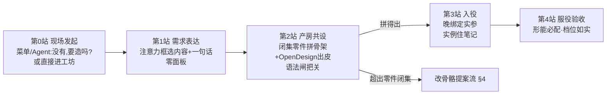

> **状态 (Status)**: active(设计定案;落位 V13+,前置依赖见 §6)
> **层 (Layer)**: 设计章程 / 组件产房
> **日期 (Updated)**: 2026-08-29
> **权威 (Authoritative)**: 是(产房域设计以本文为准);讨论轨迹见 `2026-08-29-ux-walkthrough-findings.md` §7 补一~补十
> **上游**: Template Studio 死刑案(同日)· agent-org-charter(08-26「产房时代再议」条)· 方向宪章

# 组件产房章程(Component Nursery Charter)v1

**一句话**:用户与 AI 协同制作交互组件的完整体系——从灵感到入库到服役,每一步的真相、归属与诚实性都有法可依。**旧 Template Studio 的尸体⛔不作地基**;本章程是其合法诉求(造物、改样式)在当前语法下的转世。

## §1 三段律(能力法理,Henry 勘定)

**「形状先于能力」是服役律,不是设计律**——罪名只有一个:冒充。

1. **库中形先于能(常态)**:组件库是**预备役**,件带外形 + 基础操作 + 能力接口(概念预览);**场所即申报**——躺在库里这个位置本身就如实声明了「未接线」;
2. **入役晚绑定**:能力实参(范围/数据源)属于**服役现场**,⛔ 不烧死进库件(进度条 0-100 vs 0-10000 案);
3. **服役形能必配**:进了笔记,形状与能力必须与用户预期对上;档位如实显示,违者即冒充。

## §2 制作流水线(五站)

- **创造零面板**(口子 1,Henry 拍):框选即语境(**注意力框**原语,已单独立项——价值远超组件域),异步黑盒生成,不满意迭代对话;**轻量设计面板 = 检修口**(只服务已有组件,浮动可缩放,带跳产房按钮)。三层触达:对话(创造)→ 浮动面板(微调)→ 产房(深造/成批)。
- **双入口**:工坊 / 笔记内 AI 定制。**AI 做的也不自动入库**。

## §3 库结构与持久模型(口子 2,Henry 拍)

**双维:形制(类型)× 自选集**——形制是树(表格型/旋钮型/图表型…出生自带、可扩类、**空货架不显示**),自选集是网(「报告用组件」…横切引用、多对多、**成员可精确到变体**、引用非拷贝;grow-by-use:零预设,AI 观察共现建议成集、用户确认才立)。

**每原型挂家族**:样式库(皮变体)+ 变体库(肉变体),**只增不改**;原型只被显式替换。

**三层持久模型**:
1. **库层(精选集)**:⛔ 只收显式「存下来」的。入库之门是用户的,两种开法:亲手存 / **明示委托 AI 代选**(Agent 判通用性打分)。存时**接口指纹**当分拣帽:签名不变→样式库,变→变体库(挂靠原型由用户显式选),提升→新组件。**在皮的名义下夹带肉,机器不放行。**
2. **实例层(自由覆写,住笔记)**:随手改动 = 对引用样式的 diff,落本笔记本实例,随笔记持久复原,零库污染——「不具代表性的东西不配进库,但配被记住」。**孤本实例**:未存模板的 AI 定制件,完整定义内联住笔记。
3. **毕业通道**:实例覆写随时可「存为样式/存为变体/提升为组件」——**毕业是荣誉不是义务**。

**层叠细则**:样式条目可原地编辑并自动传播(皮安全),但**实例覆写压顶部分⛔不被冲掉**(覆写永远赢);实例引用形态 = (变体, 样式) 对 + 本笔记实参绑定;组件带默认样式指针(人/AI 可拨)。

**一句话**:皮随库走,肉锁在笔记里,升级永远是笔记侧的主动动作。

## §4 改骨骼提案流(口子 3,Henry 拍)

组件所需能力超出零件闭集时:

1. **Agent 预审(拼法复检)**:「真缺零件,还是拼法没想到?」**拼得出 → 直接把成品拼给用户看**((a) 案,与异步黑盒同心智),提案消灭于无形;拼不出 → 产出带论证的**改骨骼提案**(缺什么原语/为何拼不出/影响面);
2. **裁决**(单机时代 = Henry):到手的都是过滤后带论证的真需求;
3. **通过** → 新零件排期入闭集(正常工程流水线);落地日原组件**自动解锁**(提案有记忆);
4. **驳回/推迟** → 留案挂触发器(TD/悬案同形)。

📌 本流程 = 自家开发治理(停线→裁定→修宪/排期→解锁续建)的产品化。

## §5 能力对称(Agent 域总纲)

- **律**:人能做的,AI 几乎都能做;**AI 能做的,人全能做**(旧红线「Agent 能编辑的人类必须 100% 能编辑」是其特例);
- **方向性原则(⛔ 非律,Henry 存疑降级)**:人做不了的 AI 尽量也不做——黑箱最小化,不承诺为零。

## §6 落位与前置依赖

**样式三档(V12.10,产房的苗圃)** → **Agent 对话基建(V13)** → **产房(V13.x)**。苗圃的旋钮使用数据 = 产房的需求证据。**成立条件:组件生而有消费者**(懂语法的协作者保证下游兼容,「闸与生产者同生」的组件版);捏脸不改骨骼(结构=插槽组合/字段=映射既有原语/行为=能力清单勾选)。

**开放问题(记账不裁)**:巨型组件的粒度演进(随第一个受害消费者单)· Tauri 多窗口形态下的产房布局 · 通用性打分的判据设计(A1-D4 磨合日一并)。
