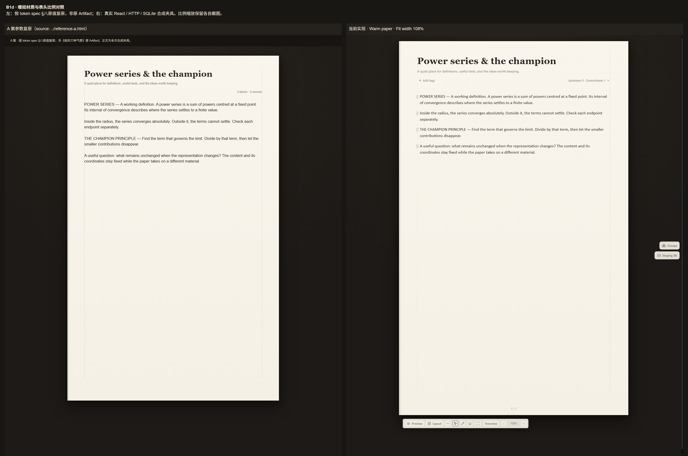

> **状态 (Status)**: done(builder 工程与机械验证完成；原 Artifact / Henry 原截图同一性仍待核)
> **From**: fable(HQ) · **To**: codex(builder)
> **日期**: 2026-09-11
> **单号**: 13.5 · B1d · 皮材质追样 + 表头比例
> **上游**: Henry 09-11 真机切暖纸反馈(截图在案:①实机与《纸的三种气质》打样气质有差;②表头比例;③墙未体现;④纸外要"本儿"感)+授权 HQ 审美定值;**细则=token spec §八(约束力等同裁定原文)**

# B1d · 材质追样

## 零 · 裁定原文

1. **表头比例跨皮统一**按 spec §八(56px 顶距/36px 衬线题/10-12-28 间距链);表头带上限收敛;⛔动块坐标(首块存量 y 间隙归 V14);
2. **墙常显度成皮级参数**(--sk-wall-idle):默认/静墨 0,暖纸 0.55 铅笔灰顶部渐入,工作台 1 带刻度;hover/拖动态现役零变;
3. **暖纸材质**逐字取 spec §八(桌面台灯光晕/纸三段渐变/三层纸影/左缘装订渐影/左墙笔记本红线右墙铅笔灰);⛔纹理⛔打孔⛔噪音件;
4. **工作台材质**补齐(桌面网格+纸描边);静墨/默认零加装;
5. **核查并对称化**:Henry 截图暖纸下右缘有一条常显竖线而左缘无(来源不明)——查明根因(疑墙带边框/溢出缘),按 §八 统一,Result 申报根因;
6. 双常备条款(挂载期新请求全夹具普查/交付前全库必跑)。

## 一 · 禁区

⛔新用户 token(材质=预设内部参数);⛔动块坐标/墙交互语义;⛔TextFlow 面;⛔安全类测试;⛔碰 .git;⛔改权限配置。收口跑受影响静态门+E1 四预设审计复跑。

## 二 · 验收

- 两端绿+全库绿;
- 冒烟(真浏览器,四预设):①暖纸整页与打样 A 案并排对照(截图双列,逐要素:光晕/纸渐变/影/墙线/红线/装订影/表头比例);②默认/静墨零像素级变化(比例链除外——表头比例为跨皮统一改动,单列申报其像素差);③工作台网格+描边;④右缘竖线根因修复对称;
- 证据落 `docs/audits/2026-09-11-b1d-builder/`。

## 三 · 申报义务

Result 必含:交付清单+diff、打样对照双列图、右缘竖线根因、表头比例改动的默认皮像素差申报、全库数字。冲突停线⛔自作主张。

## Result

2026-09-12 · Codex builder。按本单及 token spec §八完成实现与机械验证；没有 commit、push、PR、Git index 写入或权限配置修改。开工前已有的未跟踪文件全部保留。证据总入口：[B1d builder](../../audits/2026-09-11-b1d-builder/README.md)。原始参考件的缺口与孤线结论边界见下文，不把机械通过当作 HQ/Henry 主观放行。

### 交付清单与 diff

产品源码/现役测试共 14 文件：[完整 diff](../../audits/2026-09-11-b1d-builder/product-changes.patch)、[逐文件 SHA256](../../audits/2026-09-11-b1d-builder/product-change-inventory.json)、[改动前原件清单](../../audits/2026-09-11-b1d-builder/baseline-manifest.json)。

| 交付 | 实现与边界 |
| --- | --- |
| 跨皮表头 | 顶距 56px；衬线 36px/1.2/600/.01em，无衬线 34px/1.2/650；description 13px；10/12/28px 间距链。表头上限 244→240px，长内容按完整行限高且编辑时可滚动。切皮后重测字号；修复 Chromium scrollHeight 整数化把单行误算成两行。 |
| 墙常显 | 内部 `--sk-wall-idle` 默认/静墨 0、暖纸 0.55、工作台 1。暖纸从纸顶 72px 渐入，左红线 `#C26D5A @45%`、右铅笔灰 `#D8CFBC`；工作台刻度。默认/静墨不生成材质伪层。 |
| 暖纸材质 | §八原值的台灯光晕、纸三段渐变、三层纸影、左缘 10px 向右淡出的装订渐影。完整阅读纸只绘制一套材质，不在透明正文投影上叠第二套。无纹理、打孔或噪音件。 |
| 工作台 | 补齐纸外桌面、canvas/overview 的 24px `#1B2028` 网格与 `#2A313C` 纸描边。 |
| 交互与真相 | 原墙 12px 命中带、hover/drag 线条颜色/透明度/时序和事件语义保持；非交互状态只留无 handler、无 separator、pointer-events:none 的绘制。块、TextFlow、持久化 schema 与用户 token 表未改。 |
| 材质边界 | 全部是预设内部 CSS 参数；现有用户 desk/paper/wall 覆写仍生效。各根显式重置内部别名，防跨预设继承。 |

表头只改变既有纸外显示带。源块和整个 canvas persistence 在四预设切换、墙操作往返前后 deepEqual；没有改存量块坐标、contentInset 或正文 Typography。存量正文起点的间隙仍按原坐标保留。

### 打样双列与逐要素核对

[完整双列 PNG](../../audits/2026-09-11-b1d-builder/browser/warm-paper-comparison-two-column.png) · [可打开的双列 HTML](../../audits/2026-09-11-b1d-builder/browser/comparison.html) · [A 案参数复原源码](../../audits/2026-09-11-b1d-builder/reference-a.html)。

| 要素 | 实物核对 |
| --- | --- |
| 光晕 / 纸渐变 / 三影 | 使用 §八逐字参数；实际计算样式与完整纸截图保存在 browser-report。暖纸阴影绘制裁剪余量为 `80 × scale`，其它预设维持原 `32 × scale`。 |
| 左右墙 / 红线 | 两侧都从纸顶渐入；左红右灰并非同色对称。只有 idle 层有材质，hover/drag 继续显示原线。 |
| 装订影 | 10px 左缘渐影，pointer-events:none，不遮挡输入或增加命中区。 |
| 表头比例 | 四皮实测单行标题 40.8px/43.2px，字号/字重与 56/10/12/28 链通过。参考正文使用同一合成文案；真实笔记的工具、元数据、存量正文布局保留。 |

**来源限制**：仓内 `claude-log/2026-09-09.md` §93 记原件为 Artifact《纸的三种气质》，且“临时预览件已清”；§114 记 Henry 截图反馈但没有图片路径。本次已查找并向用户询问路径，未取得两份原件。因此左列明确标注“据 §八原值复原，非原 Artifact”，不申报看过原打样或完成原图逐像素对齐。

### 右缘孤线：已证机制与未证边界

原代码的左右 `.line` 都是 opacity:0，纸外 outline 也为双侧对称。真浏览器复现得到：指针远离两墙时双线均隐藏；指针进入右侧 **12px 透明命中带**时，命中 `data-page-frame-wall="right"`，只有右线 opacity:1，左线仍为 0；移开即恢复。这能产生“看似常显、只有右侧一条”的现象。新 idle 绘制让两侧按皮规则常显，原 hover/drag 机制零变。命中链、两侧样式和前后截图在 [browser-report.json](../../audits/2026-09-11-b1d-builder/browser/browser-report.json)。

**不能越过的结论边界**：Henry 原截图不可得，无法核对截图中那根线的确切 x/y 与鼠标状态。本单证明的是现役实现中可复现的单侧显影根因，**不冒认它是 Henry 原图的唯一确定归因**。原图同一性留给取得原图后的核对。

### 默认皮像素差申报

同一个一次性 SQLite 后端、同一合成笔记、Chrome 152、1440×1800/DPR 1；原 PNG 解码逐像素比较，零容差、零缩放。每幅分母 **2,592,000 像素**。

| 预设 | 当前实现 vs 改前：获准表头链的完整显示影响 | 仅回拨表头后 vs 改前：材质差异 |
| --- | ---: | ---: |
| 默认 | 155,276 像素变化 | **0 像素；最大通道差 0** |
| 静墨 | 193,976 像素变化 | **0 像素；最大通道差 0** |

表头补偿只回拨四个表头/字体文件与旧 title weight，保留全部当前材质/墙实现；并非拿旧版本替换整页。表头高度会连带移动显示中的正文/页尾及滚动条，故第一列不只包含标题字形；第二列证实除获准比例链外无像素变化。明细和取证方法：[pixel-regression.json](../../audits/2026-09-11-b1d-builder/browser/pixel-regression.json)、[sourceModes.mjs](../../audits/2026-09-11-b1d-builder/browser/sourceModes.mjs)。该零差结论的射程为上述夹具与视口。

验证中曾出现两项材质回归并全部修正：① Chrome 不支持 overflow-clip-margin 的 calc，computed 0px 导致纸边裁剪，改回 JS 计算字面 px；② 即便 opacity:0，生成墙伪层仍改变正文 LCD 抗锯齿，默认/静墨改为 content:none，不生成伪层。[单因素隔离证据](../../audits/2026-09-11-b1d-builder/browser/pseudo-probe-regression.json) 与 [材质记录](../../audits/2026-09-11-b1d-builder/material-implementation.md) 保留，失败中间态不冒充最终成绩。

### 全库、静态门与双常备条款

- 最终完整 `npm run verify:v2-bn8-runtime`：**exit 0**。证据 [runtime-gate-final-material.log](../../audits/2026-09-11-b1d-builder/runtime-gate-final-material.log) / [命令与时间](../../audits/2026-09-11-b1d-builder/runtime-gate-final-material.json)。此前日志仅作迭代记录。
- client 全库：**142 文件 / 1522 tests / 0 fail / 0 skip**。两端构建通过；server 另跑 `tsc --noEmit` 通过。
- runtime boundary **168 checks**、model contract **60 groups**；受影响的 runtime boundary / groups rail 及总门所有其它现役静态门、Source model、performance、docs、diff 检查均通过。Registry **5/5**、manifest **10/10**、parity **10/10**。
- E1 四皮最终复审：**65/65 × 4 = 260/260**，8 类浮层、88 样本、456 个 forced-hover targets、嵌套边框 0、浏览器/console 错误 0，76 张最终截图。证据 [E1 summary](../../audits/2026-09-11-b1d-builder/e1-recheck/summary.json)。E1 是浮层审计，不替代本单的完整纸/持久化复核。
- 整页真浏览器：**41/41**、HTTP 失败 0、console/runtime 错误 0；含暖纸 Pen 模式纯绘制墙、工作台 Overview 网格，以及四皮表头/墙/持久化验证。证据 [browser README](../../audits/2026-09-11-b1d-builder/browser/README.md)。
- 挂载新请求普查：全 client **534 源文件 / 142 test/spec / 46 API mock**；可达替身出口缺口 **0**。本单新增直接请求 **0**、请求 effect 变化 **0**；新增导入为纯材质函数与 useContext。完整图与差集见 [请求普查](../../audits/2026-09-11-b1d-builder/e1-recheck/request-census.md)。没有通过宽泛 mock 消音。
- 未新增或改写安全类测试；按既有总门执行只读 diff 和现役 changed-file 静态扫描，未运行安全对抗套件。没有 `.git` 写入。

补充边界：合成笔记在 Overview 中的正文左端裁切在改前/改后同景均存在；投影几何、文字及存储 canvas 全等，确认为该夹具既有投影边界，本单未动坐标修它。[基线对照](../../audits/2026-09-11-b1d-builder/browser/overview-baseline-check.json) 单独保存，不混入 41 项主报告。

工程交付可供复核；HQ/Henry 审美放行与上述原件同一性核对不由 builder 代签。
