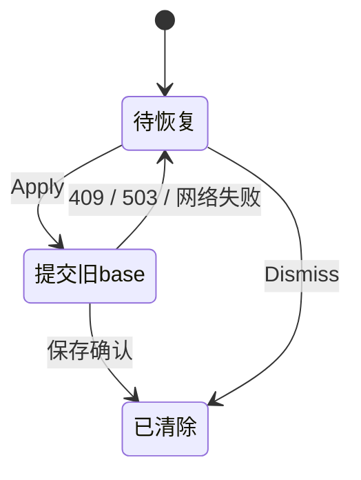
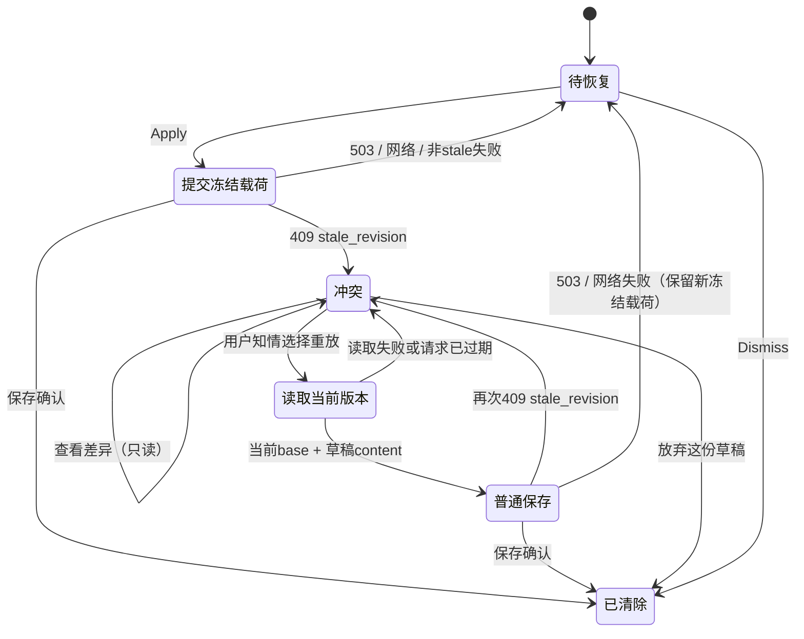

> **状态 (Status)**: done(builder 已交付；最终总门与放行留 HQ)
> **From**: fable(HQ) · **To**: codex(builder)
> **日期**: 2026-09-11
> **单号**: 13.5 · F19 · 恢复条目基版本过期=Apply 死胡同
> **上游**: HQ 真机取证(E1 验收途中):块编辑恢复横幅的 Apply 重放冻结载荷含**过期 base_revision**,text-save 稳定 409(实录:同一恢复条目跨会话多次 Apply 全 409,request id 37996.4540 族);UI 零解释零出路,用户只能盲 Dismiss(不知情弃稿)或永卡

# F19 · 恢复冲突的显式出口

## 零 · 裁定

1. **OCC 闸零松动**:过期基版本被 409 是 fail-closed 的正确行为,⛔任何"自动以新版本重放"的静默旁路——那等于盲写覆盖后来编辑;
2. **死胡同改成三岔口**:Apply 撞 409(基版本过期)时,横幅进入**冲突态**并明示:"底稿基于旧版本,内容已在别处变更"。给用户三个显式选项:
   - **查看差异**:并排/内联展示 恢复草稿 vs 当前正文(纯展示,最小可用即可);
   - **以当前为准重放**:用户知情后,以**当前 revision 为 base** 重新提交草稿内容(=一次普通的、用户新决策的保存,走既有 text-save 正门,⛔特权通道⛔history_restore 意图字段——那是 undo/redo 专用);
   - **放弃草稿**:现 Dismiss 语义,但按钮文案在冲突态下应明示丢弃的是什么(如"放弃这份草稿");
3. 非冲突失败(503/网络)维持现役重试语义零变;
4. F17 的 history_restore 通道、漂移证据保留规则,本单⛔触碰。

## 一 · 交付面

- 恢复横幅冲突态 UI(三选项)+差异展示(最小:草稿文本 vs 当前文本,逐单元并列即可,⛔富 diff 引擎);
- "以当前为准重放"实现:读当前块 revision→以草稿 content 组装普通 text-save→成功清除恢复条目;再撞 409(极端竞态)回冲突态;
- 恢复条目跨会话仍在(现役持久化机制不动),只改呈现与出口。

## 二 · 禁区

⛔动 OCC 判定/服务端;⛔自动重放;⛔动 history_restore/漂移规则;⛔TextFlow-Contract 面(本单纯 client 恢复 UI+重放组装);⛔安全类测试;⛔碰 .git;⛔改权限配置。

## 三 · 验收

- typecheck+build 绿;相关定向套件绿+新增:冲突态三选项行为测试(409→冲突态;重放以当前 base 提交且成功清条目;放弃清条目;503 仍走原重试);
- 冒烟(合成):①造过期草稿→Apply→冲突态显现三选项;②查看差异内容正确;③知情重放→200→条目清、正文=草稿;④放弃→条目清、正文不变;⑤503 注入→原重试路径零变;
- 证据落 `docs/audits/2026-09-11-f19-builder/`。

## 四 · 申报义务

Result 必含:交付清单+diff、恢复条目状态机改前/改后图、测试数字、冒烟证据。冲突停线⛔自作主张。

## 补遗一(HQ 裁定,2026-09-11;解除停线,续工)

停线成立(STOP-LINE.md 采信,状态机设计合裁定)。裁定:

### A · 授权修门(E1 遗债,归本单顺手清)

`client/scripts/canvasRuntimeBoundaryCheck.mjs:1261` 的 Export Preview 断言选择器集合已被 E1 去盒作废——**门的语义(Note detail 样式含 PageFrame 感知的 Export Preview 结构)不变,选择器跟现役**:将断言更新为 E1 去盒后 `NoteDetail.module.css` 中承载同一语义的现役 class 集合(builder 从现物取,⛔为凑门回补无用 CSS);其余两个选择器若仍在则保留。**闸保牙义务**:证据中演示对现役集合任删一项该门必红(临时变体验证,⛔入库)。

### B · 采信与续工

- 三岔口实现/独立 GET 当前 revision/普通 text-save 重放/⛔自动重试/F17 通道零触碰——全部合裁定,采信;
- 低并发复跑与 npm.cmd 用法合规,unboxing 首轮超时=13.6 flaky 名录既档,独立复验绿即按名录处理;
- 按 STOP-LINE §剩余工作 1-4 收完:修门→最终 typecheck+production build→合成浏览器冒烟余项(知情重放200/放弃/503/二次409/跨挂载/窄屏)→完整证据+工单 `## Result`。verify:v2-bn8-runtime 总门末次由 HQ 收口跑,builder 修门后跑一次 `check:canvas-runtime-boundary` 单项证明门绿即可。

## Result

2026-09-11，Codex builder 二轮续接完成补遗一 A/B。交付工作树，未 git commit / push / PR / merge；未发现新的未裁定冲突。`done` 仅表示本工单 builder 交付完成，最终 `verify:v2-bn8-runtime` 和放行仍由 HQ 收口。

### 交付清单与 diff

- 恢复 UI：`BlockEditRecoveryQueue.tsx/.module.css`，409 stale_revision 后三选项、逐单元只读草稿/正文对照、等待/失败反馈和窄屏单列。
- adapter：`useNoteCanvasDataAdapter.ts`，独立 GET 当前 revision、用户知情后用草稿 content 组装普通 text-save；当前 annotation / board ranges 复用普通重定位；请求过期不提交；再次 409 留冲突，503 留冻结载荷供原 Apply 重试。
- 接线：`useNoteCanvasLayerProps.ts`、`useNoteCanvasRuntimeController.ts`、`NoteRuntimeDocumentLayer.tsx`；新增范围 helper `recoveryReplayAnnotations.ts`。
- 定向测试：adapter、document layer、queue、annotation helper 共新增 26 个用例；既有 draft persistence / board range session 纳入定向验证。
- 补遗一 A：`canvasRuntimeBoundaryCheck.mjs:1261` 的失效 `.exportPreviewPageFrameGroup` 改为现物 PageFrame `
` 使用的 `.exportPreviewGroup`；保留 `.exportPreviewPageFrameMeta` / `.exportPreviewPageFrameTypography`。三项匹配完整 CSS 规则头，防近名前缀误通过；断言语义与其余 158 项不变。未改 `NoteDetail.module.css` 或回补 CSS。

**代码/测试/门共 12 文件，+985/-48**（业务与测试 11 文件 +981/-45，门 +4/-3；不含工单及审计证据）。完整 [diff](../../audits/2026-09-11-f19-builder/implementation.diff)、[逐文件统计与 SHA-256](../../audits/2026-09-11-f19-builder/implementation-manifest.json)、[完整证据 README](../../audits/2026-09-11-f19-builder/README.md)。其他已有脏文件排除本单统计，未触碰。

服务端/OCC、F17 history_restore 通道与漂移规则、持久化模块、TextFlow-Contract、权限配置均未修改。本轮续工只修改授权的门断言，业务实现沿用补遗一已采信版本。

### 验证数字

| 项目 | 结果 | 证据 |
|---|---|---|
| 首轮定向 | 6 文件 / 181 pass / 0 fail，新增 26 cases | `validation/targeted.json`、`targeted.log` |
| 首轮全客户端低并发复跑 | 126 文件 / 1350 pass；含最终业务小修，随后旧门失败 | `validation/runtime-gate-recheck.log`；不是总门通过 |
| 首轮 unboxing 超时独立复验 | 1 文件 / 4 pass | `validation/board-timeout-recheck.log`；按补遗一已档 flaky 裁定处理 |
| 修门后单项一次 | **159/159 checks，exit 0** | `validation/gate-boundary-final.log` |
| 闸保牙 | **三项逐一删除 3/3 红；额外近名干扰 3/3 红**，精确命中同一门 | `validation/gate-selector-evidence.md`、`gate-selector-mutations.json` 与六份失败日志 |
| 最终 client typecheck | **exit 0** | `validation/typecheck-final.log` |
| 最终 client production build | **exit 0**，2280 modules | `validation/production-build-final.log` |
| 最终 Chrome 合成冒烟 | **8 类要求全覆盖，16 快照** | `browser-final.json`、截图 03–13 |

路径均相对 `docs/audits/2026-09-11-f19-builder/`。闸保牙只在 Node 子进程读取 CSS 时返回内存变体，**0 个源码变体写盘/入库**，磁盘 CSS 与门脚本前后哈希一致。最终 typecheck/build 均在修门后运行，浏览器余项均在构建后完成。build 有既有模块动静态 import 与大 chunk 警告，未改阈值；总门不在本轮重复运行，留 HQ。

### 合成浏览器冒烟

1. 旧 base 3 Apply → 409；当前正文/revision 9 不变；三选项出现。查看差异内容正确，PUT 仍仅 1 次（03/04）。
2. 知情重放以 base 9 → 200，revision 10；adapter 和合成正文均为草稿，条目清零（05）。
3. 冲突后放弃只清条目；正文/revision 9 不变，无新增 PUT（06）。
4. 503 保留原 Apply/Dismiss；显式 Apply 后 200，两次完整 payload 相等，条目清零（07/08）。
5. 重放前注入 revision 10 保存，第二次 409 回冲突；18.344 秒后观察仍只有 2 次 PUT，无自动重放（09）。
6. 组件重新挂载后草稿保留，不自动提交；冲突呈现复位，Apply 再以冻结 base 9 → 409 后恢复三岔口（10 与 JSON）。
7. 窄屏请求 390×844，实测内容宽 375px，`scrollWidth=clientWidth`；按钮完整换行、对照单列；窄屏重新知情重放以 base 10 → 200，revision 11、条目清零（11–13）。viewport override 已 reset。

射程：真实 Chrome 点击、真实 adapter/UI、浏览器内合成 Axios transport；无业务后端/真库，跨挂载为组件卸载重挂，不是浏览器重启。fixture 的 annotation/board ranges 为空，该行为由定向测试证明。控制台有 5 条预期 Synthetic 409、1 条预期 Synthetic 503 和 2 条 Router warning，未捕获其他 error，不申报 console 零错误。

### 恢复条目状态机：改前

### 恢复条目状态机：改后

冲突呈现为内存状态；sessionStorage 持久化机制不变。重挂载后恢复条目仍在，后续 Apply 再获 409 时恢复冲突态。[首轮 STOP-LINE](../../audits/2026-09-11-f19-builder/STOP-LINE.md) 保留原文作为停线时快照，解除依据为本单补遗一。
