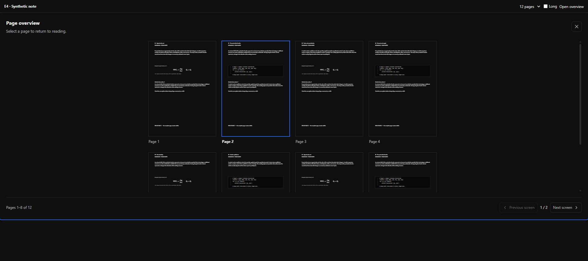
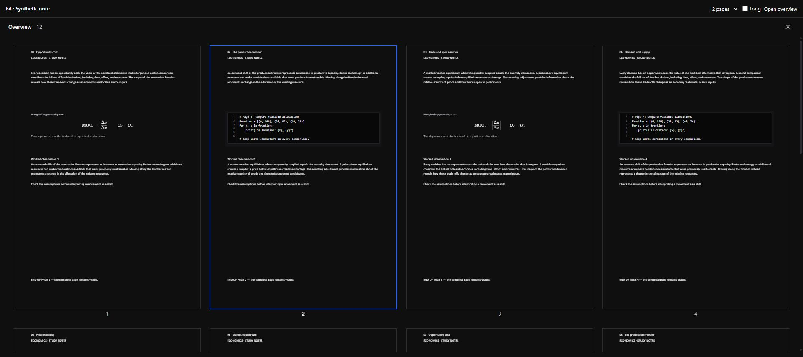

> **状态**: completed（builder 证据，待 HQ 复核）
> **日期**: 2026-09-11
> **范围**: E4 Overview 排布、导航与惰性渲染；不作为投影语义的新契约。

# E4 Overview 交付与冒烟

Overview 已改为连续纵向页面网格。页面直接使用生产 `NoteReadOnlyPageContent`，按原 frame 宽高整体缩放；没有截图、简化卡片或长页截断。打印 fragment、TextFlow、页集合数据与写入管线未修改。

## 交付文件与 diff

- `NoteOverviewLayer.tsx/.css`：轻量标题与关闭按钮、整页真实内容、居中页脚页号、当前阅读页描边、连续页壳、可见内容挂载窗口。
- `overviewLayout.ts`：纯显示几何、列数与可视窗口判定。
- `useNoteOverviewController.ts` / `NoteRuntimeDocumentLayer.tsx`：打开时从阅读 DOM 位置派生当前页，只传本地显示状态，点击仍走既有回读控制器。
- `NoteDetail.module.css`：Overview 放开原 980px 工作区限制，隐藏本视图下的底部工具条及旁侧入口，退出恢复阅读布局。
- `NoteOverviewLayer.test.tsx`：14 个新增用例；`NoteRuntimeDocumentLayer.test.tsx`：更新翻屏断言、增加当前阅读页回归。

[生产代码 diff](production.diff) 从开工前的本地文件副本生成，覆盖 6 个生产文件；[源码清单及 SHA-256](source-manifest.json) 覆盖生产与测试共 8 文件。未执行 commit。

## 布局与惰性策略

1. 视口扣除左右各 24px，按最小页宽 280px 与 24px 列间距决定 1–4 列；页数少于列数时收缩列数。多页各列分满可用宽度，页间距 24px、页脚 24px。
2. 单页按可用宽高完整缩放并居中；长页保留真实宽高比。没有旧版 220px 上限或 1.6 比例裁剪。
3. 轻量页壳及按钮保留，原生网格拥有稳定滚动高度和完整键盘顺序。仅可视区及前后各一屏挂载真实内容，离开窗口就卸载；`memo` 避免未变化页面重复渲染。页壳和几何为 O(页数)，重型内容不全量挂载。
4. 初开将当前阅读页所在行带入视口。调整宽度/列数时保留首个可视页及页内相对位置，不保留会指向其他页的旧像素偏移。
5. 预览内容保持 `inert` / `aria-hidden`，覆盖整页的原生按钮负责点击、Enter/Space；Esc 或 X 关闭。无新增动画。

## 真浏览器证据

Chrome 扩展控制，生产 Vite 开发服务。多页和大页数使用内存合成笔记，包含不同正文、真实公式、代码及页尾标记，通过生产只读投影渲染；不向数据库写测试笔记。另在现有真实单页笔记验证完整应用入口、退出及回读。原始几何和挂载数字见 [browser-metrics.json](browser-metrics.json)。

| 场景 | 结果 | 证据 |
| --- | --- | --- |
| 12 页 / 1920px | 4 列，页宽 445px；无翻屏 chrome，连续纵向滚动 | [之前](before-12-pages.png) · [之后](after-12-pages.png) |
| 960 / 720 / 390px | 3 / 2 / 1 列，均 `scrollWidth == clientWidth` | [960](after-960.png) · [720](after-720.png) · [390](after-390.png) |
| 单页夹具 | 220px 增至约 485px，完整居中，页尾可见 | [之前](before-single.png) · [之后](after-single.png) |
| 真实应用单页 | 220px 增至约 554px，工作区展开，安静 chrome | [之前](before-live.png) · [之后](after-live.png) |
| 3:1 长页 | 整页等比缩放，页尾保留 | [长页](after-long-page.png) |
| 240 页初开 | 240 个轻量页壳，16 页真实内容 / 80 fragments | [初开](after-240-start.png) |
| 240 页滚到 10800px | 24 页内容 / 120 fragments，挂载页 77–100；首页内容卸载 | [中段](after-240-scroll.png) |
| 大笔记宽窄切换 | 4 列→2 列，保持尾段可视位置，没有跳回前半笔记 | [缩窄后](after-240-resize.png) |
| 点击回读 | 夹具点击第 89 页返回 `e4-frame-89`；真实应用返回 `primary-page-frame`，Overview 消失 | JSON `fixtureReadback` / `freshLiveReadback` |
| Esc / console | Esc 关闭；合成夹具和最终新加载真实页面均无 error 日志 | JSON `escapeClosed` / `fixtureConsoleErrors` / `freshLiveErrors` |

240 页滚动及点击实测可响应，以上是实际挂载量和功能冒烟证据，未声称经过长时间压力测试或有帧率基准。

多页前后对比：

## 测试数字

| 门 | 结果 | 日志 |
| --- | --- | --- |
| 定向 Vitest，6 文件 | **78/78 PASS**，3.00s | [targeted-tests.log](targeted-tests.log) |
| TypeScript `tsc -b` | exit 0 | [typecheck.log](typecheck.log) |
| `npm run build` | exit 0，Vite 3.45s | [build.log](build.log) |
| Canvas runtime boundary | **167/167 PASS** | [static-gate.log](static-gate.log) |

基线为 5 文件 63 项。本次新增 14 个 Overview 布局/性能用例及 1 个当前阅读页用例；保留打印、笔迹与历史页坐标同几何检查。独立复核发现的 resize 位置漂移已修并补回归。构建仅有现役大 bundle 提示，定向测试有 React Router future flag 提示。按工单跑受影响秒级门，未运行包含安全测试等范围的总 runtime 门。

施工中热更新曾出现 React hook 队列错误，整页重载后恢复；最终新页面回读复验 error 数为 0。旧热更新标签页离开笔记时曾出现通用保存失败提示，本轮未输入笔记内容、未将它判定为 E4 回读失败，也未扩改保存管线；最终证据使用新加载页面。没有发现施工文件冲突。

现有打印/Overview 仍不包含标注章、高亮与纸上标题，保持上游已申报边界；本次不补投影功能。主观体验放行留 HQ / Henry。

## 复现夹具

归档文件为 [e4-overview-smoke.html](e4-overview-smoke.html)、[e4-overview-smoke.tsx](e4-overview-smoke.tsx)。临时复制两文件到 `client/` 根目录后，使用已有 Vite 服务访问 `/e4-overview-smoke.html`。参数：`?pages=1|12|240`、`&long=true`、`&selected=238`。测试后删去这两份临时复制件。交付树中两文件仅保留于本审计目录。
