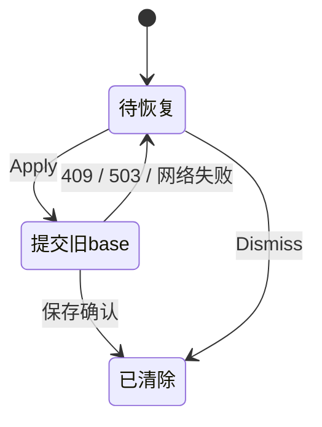
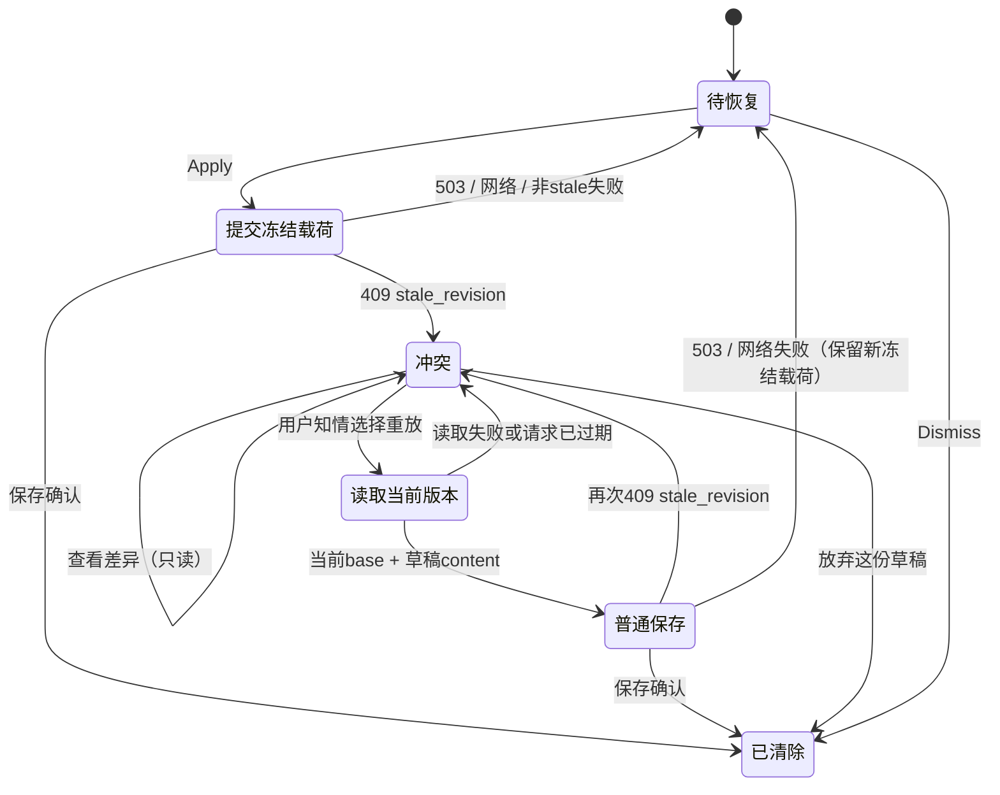

> **状态 (Status)**: completed / builder 交付，待 HQ 总门与放行
> **层 (Layer)**: builder 审计收据，非放行
> **日期 (Updated)**: 2026-09-11
> **权威 (Authoritative)**: 否

# F19 恢复冲突出口：完整交付证据

依据 [工单及补遗一](../../agent-ops/handoffs/2026-09-11-v13-5-f19-recovery-conflict-order.md)。首轮 [STOP-LINE.md](STOP-LINE.md) 保留为停线时快照；HQ 已在补遗一采信停线与实现，并授权修门、补齐本轮证据。本轮 builder 工作已完成，`verify:v2-bn8-runtime` 最终总门由 HQ 跑，本文不宣称总门绿或主观验收通过。未 commit / push / PR / merge。

## 交付与差异

F19 从“旧 base Apply 永远回到原横幅”改为显式冲突三岔口：只读查看草稿与当前正文、以最新 revision 普通保存草稿、放弃这份草稿。知情重放独立读取当前版本，再走现役 text-save；再次 409 保留冲突和草稿，不自动重放。503 / 网络失败仍保留原冻结载荷的 Apply 重试路径。

源码前缀：`client/src/pages/Notes/canvasEngine/`。

| 文件 | 交付职责 | 增 / 删 |
|---|---|---:|
| `hooks/useNoteCanvasDataAdapter.ts` | stale_revision 冲突态、独立 GET、普通重放、当前范围同步、过期请求保护 | 122 / 6 |
| `hooks/useNoteCanvasDataAdapter.test.tsx` | 新增 13 个恢复行为用例 | 194 / 0 |
| `hooks/useNoteCanvasLayerProps.ts` | 恢复 props 向 document layer 传递 | 7 / 1 |
| `hooks/useNoteCanvasRuntimeController.ts` | adapter 与 layer 接线 | 6 / 0 |
| `layers/NoteRuntimeDocumentLayer.tsx` | 使用独立恢复队列 | 11 / 38 |
| `layers/NoteRuntimeDocumentLayer.test.tsx` | 新增接线用例 | 18 / 0 |
| `layers/BlockEditRecoveryQueue.tsx` | 三选项、逐单元对照、等待/错误与鼠标焦点保护 | 174 / 0 |
| `layers/BlockEditRecoveryQueue.module.css` | 换行、窄屏单列、焦点和等待样式 | 102 / 0 |
| `layers/BlockEditRecoveryQueue.test.tsx` | 新增 8 个交互用例 | 210 / 0 |
| `recoveryReplayAnnotations.ts` | 当前 annotation ranges 复用普通重定位，仅返回变化范围 | 62 / 0 |
| `recoveryReplayAnnotations.test.ts` | 新增 4 个范围用例 | 75 / 0 |
| `client/scripts/canvasRuntimeBoundaryCheck.mjs`（仓库根相对路径） | 补遗一 A：现役 Export Preview 选择器 | 4 / 3 |
| **合计** | **12 文件，含业务/测试 11 文件与门 1 文件** | **985 / 48** |

完整差异：[implementation.diff](implementation.diff)；逐文件 SHA-256 与统计：[implementation-manifest.json](implementation-manifest.json)。以上统计不含工单与本证据目录。证据工具 `browser-fixture.tsx` / `serve.mjs` / `index.html` 是首轮留下的合成页，本轮未修改；证据文件完整清单见 [evidence-manifest.json](evidence-manifest.json)。

服务端、OCC 判定、F17 history_restore 通道、漂移算法、持久化模块、TextFlow-Contract 与权限配置均未修改。工作树其他既有脏文件不属于本交付，未触碰。CodeGraph 已优先尝试，但 CLI/MCP 当前不可用，降级为精确文件核查。

## 验证数字与时间边界

| 验证 | 结果 | 证据与边界 |
|---|---|---|
| 首轮定向套件 | 6 文件，181/181 pass；新增用例 26 | [targeted.log](validation/targeted.log)、[targeted.json](validation/targeted.json)；最终 annotation 范围合并小修前，后续全客户端复跑覆盖该小修 |
| 首轮总门 | 客户端 1349 pass / 1 timeout | [runtime-gate.log](validation/runtime-gate.log)；unboxing 超时按补遗一的既档 flaky 裁定处理 |
| 超时 suite 单独复验 | 1 文件，4/4 pass | [board-timeout-recheck.log](validation/board-timeout-recheck.log) |
| 首轮总门低并发复跑 | 客户端 126 文件，1350/1350 pass；随后旧静态边界断言失败 | [runtime-gate-recheck.log](validation/runtime-gate-recheck.log)；含最终业务小修，不是总门通过 |
| 本轮修门后单项 | 159/159 checks，exit 0；绿色单项运行 1 次 | [gate-boundary-final.log](validation/gate-boundary-final.log) |
| 本轮闸保牙 | 3/3 逐项删除红，额外 3/3 近名干扰红 | [gate-selector-evidence.md](validation/gate-selector-evidence.md)、[gate-selector-mutations.json](validation/gate-selector-mutations.json)；6 次均精确命中目标门，0 个源码变体写盘 |
| 本轮最终 client typecheck | `tsc --noEmit --pretty false`，exit 0 | [typecheck-final.log](validation/typecheck-final.log)，16:28:17–16:28:45 EDT |
| 本轮 client production build | `npm.cmd run build`（`tsc -b && vite build`），exit 0；2280 modules | [production-build-final.log](validation/production-build-final.log)，16:29:19–16:29:54 EDT |
| 本轮真实 Chrome 合成冒烟 | 8 类要求全覆盖，16 份状态快照 | [browser-final.json](browser-final.json)、截图 03–13；16:30–16:32 EDT，均在最终构建之后 |
| 本单 whitespace 检查 | exit 0 | [diff-check.log](validation/diff-check.log) |

定向分母：adapter 105、document layer 14、queue 8、annotation helper 4、draft persistence 37、board range session 13。JSON 的 `numTotalTestSuites=13` 是 describe 分组，实际运行文件数为 6。不存在的 `atomicTextSaveRepository.test.ts` 不计入。

本轮代码改动仅为门断言，业务与测试代码沿用已采信现物，没有为了“再绿一次”重复全客户端测试。总门按补遗一留 HQ，服务端构建也未作为本轮 client 构建的结果申报。production build 有 taskStore 混合静态/动态 import、产物 chunk 大于 500 kB 的警告；exit 0，未调整警告阈值。build 日志由 PowerShell 原生 UTF-16 转成 UTF-8，仅转编码，保留 stderr 包装和原始文本。

## 合成浏览器证据

真实 Chrome 操作真实 `useNoteCanvasDataAdapter` 与 `BlockEditRecoveryQueue`。浏览器内 Axios adapter 接住全部 API 请求；正文、revision 与故障由合成 transport 提供。没有启动业务后端或读取真库；不能将下表称为真实服务端 OCC / 数据库端到端验收。动作由 CUA/浏览器点击完成，证据来自只读 DOM、AX 与截图，没有直接调用 React 内部回调。

| 要求 | 实测结果 | 截图 |
|---|---|---|
| 旧 base 冲突 | base 3 → 409；正文与 revision 9 不动；三选项出现 | [03](03-final-conflict.png) |
| 查看差异 | 草稿/current unit 1 正确，当前版本 9；PUT 仍为 1 | [04](04-final-differences.png) |
| 知情重放 200 | base 9 → 200，revision 10；adapter/合成正文均等于草稿；条目 0 | [05](05-replay-success.png) |
| 放弃 | 冲突后放弃，条目 0；正文/revision 9 不变；PUT 仍仅此前 409 的 1 次 | [06](06-discard.png) |
| 503 原路径 | 首个 503 保留 Apply/Dismiss；再点 Apply → 200；两次完整 payload 相等，条目 0 | [07](07-503-retry.png)、[08](08-503-success.png) |
| 二次 409 | 知情 base 9 提交前注入另一次保存至 revision 10；第二个 409 后保留草稿/三选项；18.344 秒后的观察仍仅 2 次 PUT | [09](09-second-conflict.png) |
| 跨挂载 | 真实组件卸载/重挂保留条目，不新增 PUT；内存冲突呈现复位到 Apply；再次 Apply 仍用冻结 base 9，撞 409 后三选项恢复 | [10](10-remounted-queue.png)、JSON `remounted Apply` 快照 |
| 窄屏 | 请求 viewport 390×844，实测内容 clientWidth=scrollWidth=375；三按钮完整换行、对照上下单列；窄屏点击重新重放用 base 10 → 200，revision 11、条目 0 | [11](11-narrow-conflict.png)、[12](12-narrow-differences.png)、[13](13-narrow-replay-success.png)、[量测](browser-narrow-layout.json) |

跨挂载证据只证明本页同一浏览器 session 的组件重挂；未冒充关闭浏览器后重开。现役 sessionStorage 持久化机制未改，冲突呈现为内存状态。fixture 的 annotation/board ranges 为空，范围重定位行为由定向测试证明，不申报为浏览器实证。浏览器 viewport override 已 reset。

[browser-console.json](browser-console.json) 有 5 条预期 Synthetic 409、1 条预期 Synthetic 503 保存失败日志，以及 2 条 React Router future-flag warning；没有其他捕获的 error。不宣称 console 零错误。首轮 [browser-partial.json](browser-partial.json) 与截图 01–02 保留为历史片段，最终覆盖以本轮文件为准。

复跑：仓库根 `node docs/audits/2026-09-11-f19-builder/serve.mjs`，打开 `http://127.0.0.1:5191/`，按控件选择 stale / discard / unavailable503 / second-conflict。`Remount persisted queue` 只改 React key，保持当前合成数据与恢复持久化；整页 reload 会执行 fixture 的初始 seed，故不能拿 reload 当跨挂载证据。

## 恢复状态机

改前：

改后：

请求过期时不提交：路由/代次/水合/保存序号/恢复条目替换或新 draft 改变均由现有上下文门保护。重挂载后冲突呈现复位，但条目仍在；Apply 再获 stale_revision 时恢复冲突态。

## HQ 后续

运行补遗一指定的最后一次 `npm.cmd run verify:v2-bn8-runtime`，做独立复核与放行。本单没有新增未裁定冲突；已有停线留痕不回写、不抹除。
