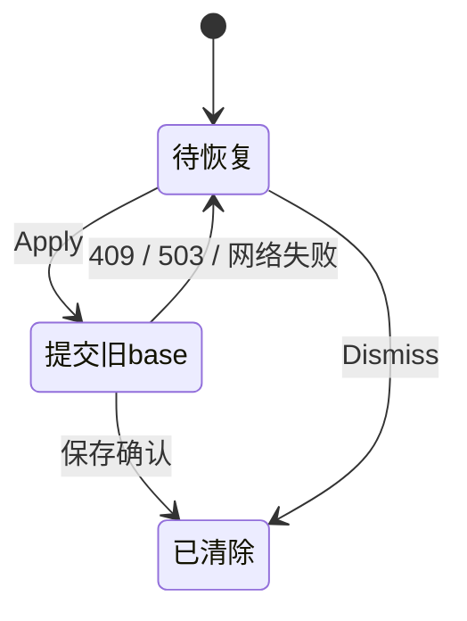
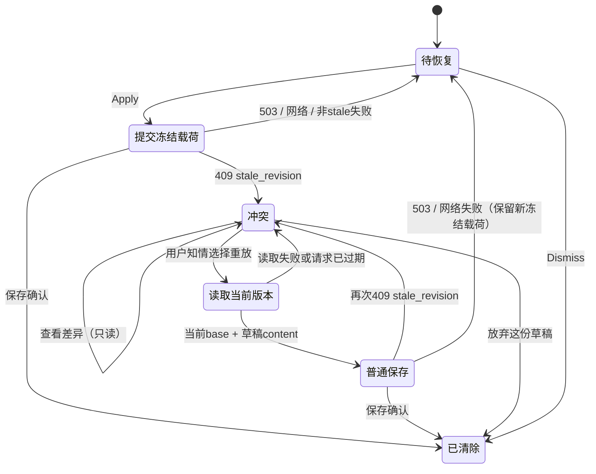

> **状态 (Status)**: blocked / 停线待 HQ 裁定
> **层 (Layer)**: builder 审计收据，非放行
> **日期 (Updated)**: 2026-09-11
> **权威 (Authoritative)**: 否

# F19 停线申报

F19 实现已在工作树，尚未完成交付。未 commit / push / PR / merge；工单未翻 done，也未追加完成性质的 `## Result`。

## 阻塞：既有总门与 E1 现役样式冲突

按根 AGENTS.md 要求执行 `npm.cmd run verify:v2-bn8-runtime`。首轮客户端测试中 `BoardPage.unboxing.test.tsx` 一项超时（1 fail / 1349 pass）；该文件单独复验通过。降低进程并发后原总门复跑：**126 文件 / 1350 tests 全通过**，随后在 `check:canvas-runtime-boundary` 中失败：

```text
Error: Note detail styles render PageFrame-aware Export Preview groups: Missing: .exportPreviewPageFrameGroup
client/scripts/canvasRuntimeBoundaryCheck.mjs:1261
```

该断言仍要求 `.exportPreviewPageFrameGroup`、`.exportPreviewPageFrameMeta`、`.exportPreviewPageFrameTypography`。HEAD 的 `client/src/pages/Notes/NoteDetail.module.css` 已无首个选择器。只读核查 `git diff -- client/src/pages/Notes/NoteDetail.module.css client/scripts/canvasRuntimeBoundaryCheck.mjs` 为空，两文件均非 F19 修改。E1 工单 Result 记录 ExportPreview 去盒和未跑总门，未发现 HQ 对此总门的豁免。

本单只授权恢复 UI 与普通 text-save 重放组装，用户同时要求“冲突停线”。因此未擅改边界检查、未补无用 CSS 来凑门、未跳过总门宣称完成。需 HQ 裁定该既有验收冲突的修单/放行方式后继续。

## 停线时现物

- 恢复冲突 UI：三项显式选择、逐 TextUnit 只读对照、失败/等待状态、鼠标焦点保护与窄屏样式。
- 409 仅以 HTTP 409 + `stale_revision` 识别，冲突状态跟随新 recovery key。新知情重放独立 GET 当前 revision，并以草稿 content snapshot 走既有普通 text-save。
- 新重放读取当前 annotation / board ranges，复用既有普通重定位算法；成功后同步此次确认的范围，保留 annotation 名称等其他本地字段。未修改服务端、F17 history_restore 通道、漂移算法或持久化模块。
- Apply 的内容组装采用已有冻结 `contentJson/plainText`，原 base / annotation / board snapshot 原样重试，保留 F17 历史意图。新增“重放 503 → Apply”整包相等断言。
- GET 期间路由/代次/水合/保存序号/条目替换/新 draft 改变时不发重放；二次 409 不自动重试。

## 已跑验证与射程

| 验证 | 结果 | 证据 |
|---|---|---|
| 定向 6 文件（adapter、document layer、queue、annotation helper、draft persistence、board range session） | 181 pass / 0 fail | `validation/targeted.json`、`targeted.log` |
| Client `tsc --noEmit --pretty false` | exit 0 | `validation/typecheck.log`；发生于最终 annotation 范围合并小修之前 |
| 首轮总门 | client 1 timeout / 1349 pass | `validation/runtime-gate.log` |
| 超时 suite 独立复验 | pass | `validation/board-timeout-recheck.log` |
| 原总门低并发复跑 | client 126 files / 1350 pass；后续静态边界门失败 | `validation/runtime-gate-recheck.log`；包含最终 annotation 范围合并小修 |
| 实际 Chrome 合成冒烟已完成部分 | 旧 base 3 Apply → 409，当前正文/revision 9 不动，三选项出现；查看对照正确且 PUT 仍仅 1 次 | `01-conflict.png`、`02-differences.png`、`browser-partial.json` |

低并发仅对该命令进程设置 `VITEST_MAX_THREADS=4`、`VITEST_MAX_FORKS=4`，未改测试配置或超时阈值。未执行安全对抗测试；总门运行的工具投影契约测试是本地静态断言。命令使用 `npm.cmd` 避免 PowerShell 对 npm.ps1 的执行策略限制，没有更改权限配置。

`atomicTextSaveRepository.test.ts` 曾作为定向参数提供，但当前无该文件，因此报告只计实际运行的 6 个文件，不计不存在的套件。

## 恢复条目状态机（实现待完整验收）

改前：



改后：



冲突呈现为内存状态；sessionStorage 机制未变。重新挂载仍保留条目，后续 Apply 再次得到 409 时恢复三岔口。

## 剩余工作

1. HQ 裁定既有总门冲突，builder 不自行扩范围。
2. 最终代码 typecheck + production build；按裁定复跑总门。
3. 继续合成浏览器：知情重放 200 / 清条目 / 正文草稿、放弃正文不变、503 原路径、二次 409、跨挂载与窄屏。单元测试已覆盖前述主要行为，但不冒充浏览器证据。
4. 完整证据 README、diff 清单/数字及工单 `## Result`，再交工作树给 HQ。

复跑合成页：`node docs/audits/2026-09-11-f19-builder/serve.mjs`，浏览器打开 `http://127.0.0.1:5191/`。fixture 使用真实客户端 adapter + UI、内存 Axios transport；不启动业务后端、不读取真库。部分截图与 AX 证据为此次真实 Chrome 操作，未把模拟服务响应当成真实数据库验证。
