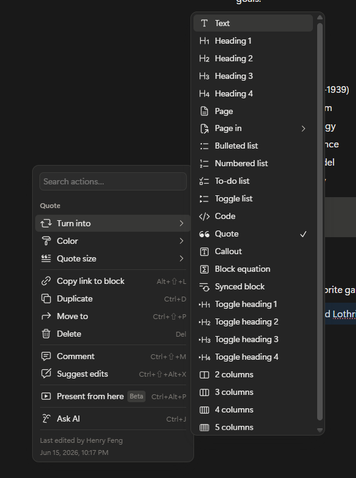

# 2026-06-17 右键菜单与命令入口调研报告

状态：专项调研报告
阶段：V2.BN.8 / TextFlow + Annotation Truth 之后的 command surface 设计
调研对象：Coincides 当前代码与文档、Office 365 Word、Notion、AFFiNE / BlockSuite，补充参考 Google Docs、ClickUp、Adobe Acrobat Reading Order
输出位置：`docs/brainstorm/产品完善/`

## 1. 调研目的

这次调研不是为了“给页面加一个右键菜单”，而是为了确定 Coincides Better Notebook 里不同操作表面的职责分工。

右键菜单本质上是 command surface 的一类。它应该回答的问题是：

用户已经指向、选中、打开、悬停或聚焦了某个对象之后，下一步最自然能做什么？

在 V2.BN.8 之前，Coincides 的很多能力都被迫浮在明面上：选区工具条、Annotation Stack 里的输入框、Block Control Bar 上的一排按钮、Preview overlay 里的开关、TextUnit 左侧的加号和 handle。随着 TextFlow、Annotation Truth、SelectionDraft、Annotation Stack 的边界越来越清楚，这些能力需要被重新分配：

- Slash menu 偏向创建与插入。
- 右键菜单偏向“对当前对象 / 当前选区做事”。
- TextUnit handle 偏向行级 / 段落级结构操作。
- Annotation Stack 偏向正式检查、管理、改色、改名、隐藏、删除。
- Preview 偏向全局显示模式和 overlay 开关。
- Block Control Bar 应该逐步退化为少量高频直接操作，而不是承载所有命令。

右键菜单的难点不在单个菜单，而在不同上下文里菜单完全不同。TextBlock 选区、Annotation 高光、Annotation Stack range preview、TextUnit handle、Block shell、Canvas 空白区域、未来图片 / shape / drawing 对象，都不应该共用一个大而全的菜单。

## 2. 当前 Coincides 自身问题清单

### 2.1 表面按钮过多

当前用户完成 annotation / inline / block 操作时，很多按钮被直接摆在界面上：

- Selection toolbar 会在选区后弹出 Annotate、formula、code、link 等按钮。
- Annotation Stack 曾经出现过 `Add same-range label`、`Add child label` 等常驻入口。
- Block Control Bar 显示 move、export、AI visibility、save、annotate、trash 等按钮。
- Label badge 和 Annotation Stack 的关系仍然偏重调试阶段，视觉和入口都显得比较重。

这些按钮在早期调试阶段有用，但如果长期保留，会让界面显得像工程面板，而不是安静的笔记软件。

### 2.2 单次文本选择不一定代表“我要操作”

很多用户阅读时会习惯性框选文字。这种行为不一定代表他们想标注、转换、加公式或加链接。

因此，单次普通文本选区不应该自动弹出完整 toolbar。更自然的规则是：

- 单次普通选区：只显示选区本身；用户右键或快捷键才触发命令。
- Ctrl / Command 多段选区：用户意图更明确，可以显示轻量 SelectionDraft 工具条。
- Esc / 点击外部：取消 SelectionDraft。

### 2.3 Annotation Stack 不应该承担临时选区入口

Annotation Stack 的职责应该是管理已经存在的 AnnotationTruth，而不是让用户在里面不断看到临时创建按钮。

特别是 child label：

- Child label 不是和 parent label 平级的对象。
- Child label 是为了说明 parent label 内部某一段语义而存在。
- 正确入口应该是：打开 parent annotation -> 在 parent range preview 中选中一段文字 -> 右键 -> Add child label。

这意味着 Annotation Stack 内部的 range preview 本身也需要右键菜单。

### 2.4 Block 已经退化，不应该继续吞下语义职责

V2.BN.8 后的产品哲学已经发生变化：

- TextFlow 是自然写作地基。
- AnnotationTruth 是语义标注地基。
- Block 主要负责外壳、布局、渲染、摆放和特殊交互。

所以右键菜单不能再围绕“把 block 变成 definition / heading / source quote”这套旧思路设计。Definition、heading 等常规知识结构应该更多进入 TextFlow / Annotation / writing role，而不是继续膨胀 block taxonomy。

## 3. Coincides 内部 Command Surface Inventory

### 3.1 Text selection context menu

对象：TextBlock / TextUnit 内的一段选中文字。

是否需要右键菜单：需要，而且优先级最高。

适合放入：

- Annotate / 标注
- Inline Formula / 转行内公式
- Inline Code / 转行内代码
- Link / 加链接
- Quote / 局部引用样式，是否进入首版待定
- Copy
- Cut
- Paste / Paste as plain text，是否接管浏览器行为待定

不适合放入：

- Turn into heading / list / todo / toggle：这属于 TextUnit handle。
- Duplicate block / delete block：这属于 Block shell。
- Export / AI visibility：这属于 Block shell 或 Inspector。

当前应替代的表面按钮：

- 单次选区后的完整 floating toolbar。
- toolbar 里暂时不可用的 formula / code / link 按钮。

建议：V2.BN.8.6.5 首先实现 Text selection context menu seed。

### 3.2 Annotation range context menu

对象：已经属于某个 parent annotation 的 range preview 内部选区，尤其是 Annotation Stack 里的 range preview。

是否需要右键菜单：需要。

适合放入：

- Add child label
- Copy selected range
- Inline Formula / Inline Code，未来可选
- Open source position / jump to text，未来可选

不适合放入：

- Add same-range label：不建议保留显眼入口。
- Rename parent label：应在 Annotation Stack 主体完成。
- Change parent color：应在 Annotation Stack 主体完成。

当前应替代的表面按钮：

- Annotation Stack 内常驻 child label 输入框。
- Annotation Stack 内 `Add same-range label`。

### 3.3 Annotation badge / highlight menu

对象：正文中的 label badge、annotation 高光区域、局部 label cluster。

是否需要右键菜单：需要，但不一定在 8.6.5 首版完成。

适合放入：

- Open in Annotation Stack
- Rename
- Change color
- Hide label
- Delete label
- Copy label reference，未来可选
- Add child label，仅当用户已在 parent range 内形成子选区时出现

不适合放入：

- 新建 TextUnit / 插入 block。
- 复杂 relation 操作，应该等 relation 版本接入。

说明：

Label badge 不应长期堆在 block 右上角。它应该逐步靠近实际高光区域，并且聚合多个 label。badge menu 也应该锚定具体 label，而不是锚定整个 block。

### 3.4 TextUnit handle menu

对象：某一行、某一段、某个 TextUnit 左侧的 handle。

是否需要菜单：需要，但它更像 handle menu，不一定是传统右键菜单。

适合放入：

- Turn into paragraph
- Turn into heading
- Turn into bullet list
- Turn into numbered list
- Turn into todo list
- Turn into toggle list
- Annotate this unit
- Split block from here
- Extract to new block
- Duplicate unit
- Delete unit

不适合放入：

- Inline Formula / Inline Code / Link：这些是文本选区行为。
- Change block shell：这是 Block shell 行为。
- Canvas paste / insert object：这是 Canvas blank 行为。

说明：

TextUnit handle 是“这一行 / 这一段怎么变”的入口。Notion 和 AFFiNE 都把行级 / block 级操作放在左侧 handle 或 slash command 一类入口里，这一点适合 Coincides。

### 3.5 Block shell menu

对象：整个 block 外壳，不是 block 内部文本。

是否需要右键菜单：需要，但优先级低于 Text selection 和 Annotation range。

适合放入：

- Duplicate block
- Delete / Move to trash
- Copy block link
- Annotate whole block
- Hide from AI context
- Exclude from export
- Convert block shell / change shell style，未来可选
- Bring forward / Send backward，等 CanvasObject / layer 体系成熟后再做

不适合放入：

- Definition / theorem / example 等知识角色。
- Inline formula/code。
- TextUnit writing role。

当前可能被替代的表面按钮：

- Block Control Bar 上的 annotate block。
- Block Control Bar 上的 trash。
- AI visibility / export role，可先留在 Preview overlay 或 inspector，后续再收束。

不应该替代的按钮：

- Move / drag handle：拖动需要直接 affordance，最好继续保留。

### 3.6 Canvas blank / PageFrame blank menu

对象：PageFrame 空白区域、workspace 空白区域、未来无限画布空白区域。

是否需要右键菜单：需要预留，但 8.6.5 不建议做重。

适合放入：

- Paste here
- Insert TextBlock
- Insert Image
- Insert Shape
- Insert Drawing
- PageFrame settings
- Canvas background / grid settings
- Change page size，未来可选

不适合放入：

- Text selection actions。
- Annotation Stack 管理动作。

说明：

当前 CanvasObject / drawing / image 还没有完全成熟，空白 canvas 菜单可以先写进设计，不急着产品化。

### 3.7 Future CanvasObject menu

对象：未来图片、shape、drawing、region、media object。

是否需要右键菜单：需要，但属于 V2.BN.8.7 之后。

适合放入：

- Duplicate object
- Delete object
- Bring forward / Send backward
- Lock / unlock
- Annotate object
- Crop / fit / replace image
- Convert to frame / region，未来可选
- Object style

说明：

CanvasObject 菜单必须等 CanvasObject 数据结构和交互稳定后再做，否则会变成空菜单。

## 4. Office 365 Word 观察

公开资料限制：这里主要使用 Microsoft Support 和 Microsoft Q&A。真实 Office 365 桌面版 / 网页版可能随版本有所差异，但这些资料足以确认 Word 的 command surface 分工。

### 4.1 选区后有 Mini Toolbar

Word 支持选中文字后显示 Mini Toolbar。Microsoft Support 说明 Mini Toolbar 会提供常用格式工具，例如字体、对齐、颜色、缩进、项目符号等，并且当鼠标移开时会淡出或消失。

设计启发：

- Word 可以自动弹工具条，是因为它的主场景是格式化文字。
- Coincides 不应该照搬“单次选区就弹完整 toolbar”，因为 Coincides 的选区还可能代表阅读、annotation、child label、multi-range draft。
- 更合适的做法是：单次选区保持轻；右键再给命令；多段 SelectionDraft 才显示轻量 toolbar。

### 4.2 右键文本可以添加评论

Microsoft Support 的现代评论说明里，Word 可以通过选中文字右键新建 comment，也可以通过 Review tab、Comments pane、快捷键等入口新建 comment。

设计启发：

- 同一个命令可以出现在多个入口：右键、toolbar、快捷键、侧边 pane。
- Coincides 也应该让 `Annotate` 同时拥有右键入口、SelectionDraft toolbar 入口、未来快捷键入口，而不是只绑定一个按钮。

### 4.3 Word 的右键菜单和格式菜单分层

Microsoft Q&A 中有用户提到 Word 右键时会出现格式相关菜单和标准 context menu，例如 copy/paste/thesaurus 一类动作。虽然这是问答资料，不如 Microsoft Support 稳定，但它符合 Word 的典型体验：格式化和对象命令分层出现。

设计启发：

- Coincides 的 Text selection menu 也应该分组：
  - 高频结构动作：Annotate / Inline Formula / Link。
  - 基础编辑动作：Copy / Cut / Paste。
  - 未来 AI / comment 动作。
- 不要把所有命令平铺成一长列。

### 4.4 Word 对快捷键非常重视

Word 的官方快捷键文档覆盖复制、粘贴、剪切、注释、格式、选择、多段选择等操作。

设计启发：

- 右键菜单不应该替代快捷键。
- Coincides 后续应让 context menu command registry 能被右键、toolbar、快捷键复用。

## 5. Notion 观察

公开资料限制：Notion 真实右键 / block handle 菜单有一部分需要登录产品体验确认；这里主要使用 Notion Help 和用户可见产品模式。

### 5.1 Notion 把职责拆成多个入口

Notion 并不是只靠右键菜单。它至少有这些入口：

- 选中文字后的 formatting menu。
- `/` slash command。
- block 左侧 `⋮⋮` handle。
- `+` 插入入口。
- 表格 / database / code block 等特殊对象自己的菜单。
- 页面级 more menu。

设计启发：

- Coincides 也不应该用一个右键菜单解决所有事。
- Slash menu 继续负责创建 / 插入。
- TextUnit handle 负责行级结构转换。
- 右键菜单负责“当前选区 / 当前对象”。
- Annotation Stack 负责正式管理。

### 5.2 Notion 支持选区转 inline equation

Notion Math Equations 文档说明，用户可以输入 `$$` 创建行内公式，也可以高亮一段公式文本后通过 formatting menu 里的 equation 图标转换。

设计启发：

- Coincides 的 Inline Formula 最自然入口就是文本选区右键菜单。
- 独立 FormulaBlock 仍可以作为展示型 block 存在，但普通正文中的公式应优先走 inline structure。

### 5.3 Notion 的 block handle 承担 Turn into / Duplicate / Delete 等操作

Notion 的 block handle 常见功能包括 Turn into、Color、Copy link to block、Duplicate、Move to、Delete、Comment、Ask AI 等。

设计启发：

- Coincides 的 TextUnit handle / Block shell menu 要区分：
  - TextUnit handle：Turn into heading/list/todo/toggle、split、extract。
  - Block shell：duplicate block、delete、copy block link、AI/export policy。
- 不要把 list / heading 继续当作独立 block type 膨胀。

### 5.4 Notion 用 slash command 承担插入和创建

Notion 的 slash command 主要用于插入新块、改变当前块类型、调用常用内容结构。它不适合作为“先选中文字再转换”的唯一入口。

设计启发：

- Coincides 的 `/formula` 可以创建 FormulaBlock 或 reserved inline action，但“选中现有文本 -> 转 formula”应该走右键或 formatting menu。
- `/heading` 等更适合改变当前 TextUnit writing role，而不是创建独立 HeadingBlock。

### 5.5 Notion 的特殊对象有自己的局部菜单

Notion 表格、code block、synced block 等对象都有各自菜单。例如 code block 可以通过对象上的菜单控制 wrap code 等属性。

设计启发：

- Coincides 未来 image / drawing / shape / table / code block 都需要对象菜单。
- 这些不应该混入 Text selection menu。

## 6. AFFiNE / BlockSuite 观察

公开资料限制：AFFiNE 的具体右键菜单公开文档不如 Notion 详细，部分页面访问存在限制。本节主要依据 AFFiNE 官方介绍、AFFiNE 文档搜索结果、BlockSuite 文档和公开源码项目说明。

### 6.1 AFFiNE 把 Doc、Edgeless、Database 视为统一 workspace

AFFiNE 官方站强调它把 docs、whiteboards、databases、AI 组合在一个 workspace 中。它有 Page / Edgeless 两种主要视角，写作和白板不是完全割裂的东西。

设计启发：

- Coincides 的 PageFrame / Canvas 设计方向是合理的。
- 右键菜单也要区分 page 写作区、canvas workspace、future CanvasObject，而不是只照搬普通文档编辑器。

### 6.2 BlockSuite 的 page / edgeless 数据是同构思路

BlockSuite 的 edgeless data structure 文档提到 page mode 和 edgeless mode 的文档结构是同构的，不需要做数据转换；文档由 blocks 组成。

设计启发：

- Coincides 也应该避免右键菜单直接绑定某一种 view。
- 同一个 TextFlow / AnnotationTruth command 应该能在 Page mode 和 Canvas mode 复用。
- Context menu 应该调用 command registry，而不是把逻辑写死在某个 layer。

### 6.3 AFFiNE / BlockSuite 的 selection 是明确状态

BlockSuite 有 selection 相关数据模型与服务概念。虽然具体页面访问有限，但公开资料和 API 文档都能看出，它不是简单依赖浏览器 selection 完成所有编辑状态。

设计启发：

- Coincides 已经建立 SelectionDraft 是正确方向。
- 右键菜单应消费 Coincides 自己的 SelectionDraft，而不是直接信任 browser-native selection。
- Ctrl 多段选区、child label、future cross-block selection 都需要这种自有 selection truth。

### 6.4 AFFiNE 的 block / slash / edgeless 对 Coincides 的提醒

AFFiNE 更接近“block editor + whiteboard”的混合体。它提醒 Coincides：

- block handle / slash command / canvas object tool 是不同入口；
- edgeless 上的对象菜单未来会非常重要；
- 但 Coincides 的语义核心已经从 block 继续下沉到 TextFlow + AnnotationTruth，所以不能完全照搬 AFFiNE 的 block-first 思路。

## 7. 其他产品补充观察

### 7.1 Google Docs：右键可以保存 custom building block

Google Docs 的 custom building block 帮助文档说明，用户可以高亮内容，右键选择保存为自定义 building block，也可以通过 `@` 菜单插入。

设计启发：

- 同一个功能可以有两个入口：
  - 选中内容后右键保存 / 转换；
  - 用 command menu 插入已有结构。
- Coincides 后续的 annotation set / reusable snippet / template-like object 也可以采用这个双入口模式。

### 7.2 ClickUp：slash command 可用范围按位置变化

ClickUp 文档说明 slash command 可在任务描述、评论、Docs、Text Cards、Notepad、Chat 等位置使用，但可用命令取决于上下文。

设计启发：

- Coincides 的 command registry 也应该支持 context gating。
- 同一个命令不必在所有地方出现。
- 右键菜单和 slash menu 都应该读取同一个“当前 surface + selection + object type”判断。

### 7.3 Adobe Acrobat Reading Order：标注区域是另一种局部命令表面

Adobe Acrobat 的 Reading Order 工具允许用户选中页面区域并指定 tag type，也支持通过区域 context menu 编辑 alternate text 等。

设计启发：

- 这很接近 Coincides 未来 source snapshot / structured source projection / annotation truth 的方向。
- 用户先选范围，再赋予解释或标签；范围和标签不一定等于原始文本结构。
- 这支持 Coincides 的 annotation-first 思路：语义不是输入时就固定，而是在后续阅读 / 整理 / AI 辅助中逐步标注出来。

## 8. 横向对比表

| 产品 | 选中文字 | 行 / 段 / block 入口 | 特殊对象菜单 | 空白区域菜单 | 对 Coincides 的启发 |
| --- | --- | --- | --- | --- | --- |
| Word | Mini Toolbar + context menu，可右键 comment | 段落格式多在 ribbon / toolbar | 图片 / 表格等有对象菜单 | 文档空白右键偏基础编辑 | 选区工具条可以存在，但 Coincides 要更克制 |
| Notion | Formatting menu，支持 inline code/link/equation/comment | `⋮⋮` block handle + slash menu | code/table/database 有局部菜单 | 页面内插入更多依赖 slash / block insertion | 多入口分工非常值得借鉴 |
| AFFiNE | 公开资料较少，整体是 block + doc/edgeless | block / slash / edgeless object 思路明显 | 白板对象未来菜单重 | Edgeless 需要对象级操作 | Page/Canvas 同构、selection truth 值得借鉴 |
| Google Docs | 选中内容后可右键保存 building block | 主要通过 toolbar / menu | 图片 / 表格有对象菜单 | 文档空白偏基础编辑 | 右键负责“把选中内容变成可复用对象” |
| ClickUp | 命令按位置变化 | slash command 依上下文出现 | 依不同模块变化 | 依表面变化 | command registry 要有 context gating |
| Adobe Acrobat | 区域选择后指定 tag type | Reading Order panel 管区域 | 区域 context menu 可编辑替代文本 | 页面区域可被选择/标注 | Annotation / source projection 的长期参考 |

## 9. 对 Coincides 的设计启发

### 9.1 不做一个万能右键菜单

万能菜单一定会变成菜单地狱。

Coincides 应该做一组 context menu：

- Text selection menu
- Annotation range menu
- Annotation badge / highlight menu
- TextUnit handle menu
- Block shell menu
- Canvas blank menu
- Future CanvasObject menu

每个菜单只显示当前上下文真正可用的命令。

### 9.2 右键菜单要基于 command registry

不建议每个组件自己写一套菜单逻辑。

更稳的方向是：

```text
current surface
  + selected object
  + selection draft
  + active annotation context
  + mode/page/canvas state
  -> resolve available commands
  -> render context menu / toolbar / handle menu
  -> execute shared command
```

这样以后快捷键、toolbar、right-click、slash menu 都可以复用同一批 command，而不是各写各的。

### 9.3 单次选区保持安静，右键才行动

建议规则：

- 普通拖选一段文字：不自动弹完整 toolbar。
- 右键选区：打开 Text selection menu。
- Ctrl 多段选区：显示轻量 SelectionDraft toolbar。
- toolbar 只显示 range count、Annotate、Cancel，其他功能尽量进右键菜单。

这比 Word / Notion 更适合 Coincides，因为 Coincides 的 selection 还承担 annotation truth 和 future relation endpoint 的地基职责。

### 9.4 Child label 入口应该来自 parent range 内的选区

Child label 的自然操作是：

1. 打开 parent annotation。
2. 在 parent range preview 里选中局部文本。
3. 右键 Add child label。

这样 child label 永远不会给人“和 parent 平级”的错觉。

### 9.5 Inline Structure 的入口应该主要是选区菜单

Formula / inline code / link 这类东西，本质是对当前选中文字的显示或交互方式转换。

它们不适合作为独立 block 的默认入口，也不适合只靠 slash menu。

推荐：

- 空白处 `/formula`：创建展示型 FormulaBlock 或插入 formula placeholder，视后续版本决定。
- 选中文字右键 Inline Formula：转换为 inline structure。
- 选中文字右键 Inline Code / Link：同理。

### 9.6 Block shell 菜单不要再承担知识语义

Block shell 菜单应该管理：

- 位置
- 外壳
- 渲染形式
- AI/export policy
- 删除/复制/引用

它不应该管理 definition、example、theorem 这种知识语义。知识语义属于 AnnotationTruth。

## 10. 建议的右键菜单体系

### 10.1 Text Selection Menu

触发：

- 在 TextBlock / TextUnit 内选中文字后右键。

建议首版菜单：

```text
Annotate
Inline formula
Inline code
Add link
---
Copy
Cut
Paste
```

首版可选策略：

- Inline formula/code/link 如果底层还未完成，可以显示为 disabled，并说明 reserved。
- Copy / Cut / Paste 是否接管浏览器原生命令，需要谨慎决定。

### 10.2 Annotation Range Menu

触发：

- 在 Annotation Stack 的 parent range preview 内选中文字后右键。

建议首版菜单：

```text
Add child label
Copy selection
```

未来扩展：

```text
Inline formula
Inline code
Open source position
```

### 10.3 Annotation Badge / Highlight Menu

触发：

- 右键正文里的 annotation badge 或高光区域。

建议菜单：

```text
Open in Annotation Stack
Rename
Change color
Hide
Delete
```

未来扩展：

```text
Copy annotation link
Create relation from this
Add to annotation set
```

### 10.4 TextUnit Handle Menu

触发：

- 点击或右键 TextUnit 左侧 handle。

建议菜单：

```text
Turn into
  Paragraph
  Heading
  Bullet list
  Numbered list
  To-do
  Toggle
Annotate this unit
Split block from here
Extract to new block
Duplicate unit
Delete unit
```

### 10.5 Block Shell Menu

触发：

- 右键 block 外壳、block 边框、block control handle。

建议菜单：

```text
Annotate whole block
Copy block link
Duplicate block
Delete / Move to trash
---
Hide from AI context
Exclude from export
```

未来扩展：

```text
Change shell style
Bring forward
Send backward
Lock
```

### 10.6 Canvas Blank Menu

触发：

- 右键 PageFrame / workspace 空白区域。

建议先预留：

```text
Paste here
Insert TextBlock
Insert Image
Insert Shape
Insert Drawing
Canvas settings
```

V2.BN.8.6.5 不建议重点做，除非实现成本很低。

### 10.7 Future CanvasObject Menu

触发：

- 右键 image / shape / drawing / region / future media object。

建议未来菜单：

```text
Annotate object
Duplicate
Delete
Lock
Bring forward
Send backward
Style
```

等 V2.BN.8.7 CanvasObject 进入后再做。

## 11. 哪些明面按钮可以被替代

### 11.1 可以逐步替代

- 单次选区后自动弹出的完整 Selection Toolbar。
- Selection Toolbar 上的 Inline Formula / Inline Code / Link 按钮。
- Annotation Stack 内常驻的 Add child label 输入框。
- Annotation Stack 内的 Add same-range label。
- Block Control Bar 上的 annotate block。
- Block Control Bar 上的 trash，等 Block Shell Menu 稳定后可以下沉。
- Block Control Bar 上的 export / AI policy，未来可以进入 block menu 或 inspector / preview 管理。

### 11.2 暂时不应该替代

- TextUnit 左侧 handle / plus：它是用户理解 TextUnit 的重要 affordance。
- Block move handle：拖拽需要直接入口。
- Preview overlay 开关：这是全局显示模式，不是局部右键菜单。
- Annotation Stack 里的 label 名称、颜色、hide/delete：当用户已经打开 Stack，管理入口可以保留。
- Slash menu：创建/插入仍然需要键盘优先入口。

## 12. V2.BN.8.6.5 建议范围

V2.BN.8.6.5 不应该试图一次性完成所有右键菜单。建议作为 Context Menu Foundation。

### 12.1 必做

1. 建立 context menu command registry seed。
2. Text selection context menu：
   - Annotate。
   - Inline Formula / Inline Code / Link 先可 reserved 或 disabled。
   - Copy。
3. Annotation Stack range preview context menu：
   - Add child label。
   - Copy selection。
4. 单次普通文本选区不自动弹完整 toolbar。
5. Ctrl 多段 SelectionDraft 保留轻量 toolbar。
6. 移除 / 隐藏 Annotation Stack 中不该常驻的临时入口。
7. 文档同步：把右键菜单体系写入 V2.BN.8 open issue / inventory 后续队列。

### 12.2 可做但不强求

- Annotation badge / highlight menu 的第一版：Open stack / Rename / Color / Hide / Delete。
- Block shell context menu 的第一版：Annotate whole block / duplicate / delete。

### 12.3 不建议本版做

- Canvas blank menu 产品化。
- CanvasObject menu。
- 完整 Copy/Cut/Paste override。
- 完整 inline structure editor。
- 完整 TextUnit split / merge / extract 工作流。
- Relation endpoint 相关菜单。

## 13. 后续版本建议

### V2.BN.8.7

重点接 CanvasObject、media、drawing、image seed。

右键菜单相关：

- CanvasObject menu seed。
- Object annotation menu。
- Image / drawing / shape 的 duplicate/delete/style。

### V2.BN.8.8 或后续 polish

重点做体验收束：

- label badge 局部聚合显示。
- Annotation Stack 视觉重设计。
- Preview label overlay 与右键菜单互通。
- 更成熟的 multi-label context menu。
- block control bar 的进一步瘦身。

### A9 / Editor Studio 阶段

重点做 command system 产品化：

- Command registry 正式 contract。
- 用户可定制 command / shortcut。
- TextUnit split / merge / extract 全套。
- InlineStructure editor。
- Annotation set / relation endpoint / source projection 菜单。

## 14. Open Questions / 需要用户拍板的问题

1. 单次普通文本选区是否完全不弹 toolbar？

建议：不弹完整 toolbar。只保留 native-like selection；右键或快捷键触发操作。

2. Ctrl 多段选区是否继续显示轻量 toolbar？

建议：保留。因为这是用户明确进入 SelectionDraft 的信号。

3. Text selection menu 是否接管 Copy / Cut / Paste？

建议：第一版谨慎。可以先提供 Copy；Cut/Paste 暂时保留浏览器默认或只在可控场景启用。

4. Inline Formula 在 8.6.5 是 active 还是 reserved？

建议：如果底层 InlineStructure 写回还不稳，先 disabled/reserved；但菜单位置要先占住。

5. Block Control Bar 是否在 8.6.5 立刻瘦身？

建议：不要一次性大改。先让右键菜单跑起来，再逐步下沉 annotate / trash / AI/export policy。

6. Annotation badge / highlight menu 是否进 8.6.5？

建议：如果 8.6.5 实现量可控，可以做 Open stack / Color / Hide / Delete seed；否则留到 8.6.6 或 8.8 polish。

7. Canvas blank menu 是否在 8.6.5 展示给用户？

建议：暂时不展示或只做非常轻的 Paste here / Insert TextBlock。CanvasObject 没完成前，不要做重。

8. Child label 是否只允许从 parent range preview 内创建？

建议：是。这样最符合 child label 的语义，也能避免它和 parent label 平级。

## 15. 推荐结论

Coincides 的右键菜单体系应该采用“多 surface + command registry + context gating”的路线。

最重要的产品判断是：

右键菜单不是用来补一个缺失按钮，而是用来让界面恢复安静。

具体来说：

- 单次文本选区不应该被自动工具条打扰。
- 选中后右键，才出现局部转换和标注命令。
- Ctrl 多段选区是明确操作意图，可以保留轻量 toolbar。
- Annotation Stack 只管理已经存在的 annotation，不再塞临时创建输入框。
- Child label 入口应该从 parent range preview 的局部选区产生。
- Block shell menu 管外壳，不管知识语义。
- Slash menu 管创建 / 插入，不承担所有选区转换。

这条路线和 Coincides 现在的产品哲学一致：TextFlow / AnnotationTruth 承载知识和语义，Block 承载布局、外壳、渲染与特殊交互。

## 16. 批注融合与修订方向

本节融合 `2026-06-17-右键菜单调研报告批注暂存.md` 中的阅读批注。它保留为报告内部修订记录，后续如果要把报告改成更正式的 product / contract 输入，可以把本节进一步拆回对应章节。

### 16.1 Text Selection Menu 修订

文本选区右键菜单是 8.6.5 的核心入口，但它不应该把所有功能平铺出来。

菜单需要按职责分组：

- 基础编辑：`Copy`、`Cut`、`Paste`。
- 语义标记：`Label`。
- 写作结构转换：`Turn into` 子菜单。
- 行内转换：`Inline` 子菜单。
- 链接 / 引用：`Link` 或未来独立链接分组。

其中 `Copy / Cut / Paste` 是用户最熟悉、最高频的操作，应该浮在第一层，不应该藏入深层菜单。

`Annotate` 是内部工程语言，不适合直接暴露给用户。用户可见入口应使用：

- `Label`
- `添加标签`
- `标记`

内部仍然可以使用 `AnnotationTruth`、`AnnotationRange`、`AnnotationStack` 等命名保持数据层清晰。

原报告中把 `Turn into heading / list / todo / toggle` 判定为不适合文本选区菜单，这一点需要修正。更准确的判断是：它们可以出现在文本选区菜单里，但必须进入 `Turn into` 子菜单，并且根据选区范围决定实际行为。

如果用户选中整行 / 整段：

- 这更接近 TextUnit 级操作；
- 可以把该 TextUnit 转为 heading / quote / bullet / numbered / todo / toggle。

如果用户只选中部分文字：

- 仍可以允许选择 `Turn into`；
- 但底层行为需要后续再定义；
- 可能是轻量样式、inline structure，或自动抽出新的 TextUnit。

不适合进入文本选区菜单的操作包括：

- `Duplicate block`
- `Delete block`
- `AI visibility`
- `Export status`

这些属于 block shell、AI policy、export policy 或 page frame 层级，不是文本选区层级。

### 16.2 Annotation Range Preview Menu 修订

Annotation Stack / Label panel 里的 range preview 不应该被理解为纯文本快照。

它是一个轻量编辑投影：

- 一个 label 可能由多个不连续 range 组成；
- range preview 需要展示这些 range；
- 用户可能在 range preview 中继续编辑细节；
- 未来正文中的 inline formula / inline code / link 等格式也应同步到 range preview；
- 用户在 range preview 里做出的 inline 转换，也应写回正文 TextFlow。

因此，Annotation range preview menu 应继承 Text Selection Menu 的大部分能力。

核心差异是：

- 普通正文中叫 `Label`；
- Parent label 的 range preview 中叫 `Child label`。

因为用户已经处在某个 parent label 的上下文中，所以新增标记默认应该是 child label，而不是平级 label。

### 16.3 Annotation Badge / Highlight Menu 修订

Badge 本体太小，不适合作为右键菜单的主要目标。

Badge 推荐交互：

- 单击 badge：打开 Label panel / Annotation Stack。
- 双击 badge：进入 rename，或打开 panel 并聚焦 label 名称输入。
- 右键 badge：暂不作为第一版重点入口。

真正需要右键菜单的是正文中的 highlight 区域。

Highlight 右键菜单适合提供：

- `Open label`
- `Change color`
- `Hide label`
- `Remove label from this range`
- `Copy`

`Rename` 不适合放在 highlight 右键菜单里。用户右键高光文字时看到 rename 会比较突兀；rename 更适合 badge 双击或 Label panel 内完成。

需要后续拍板的问题：

- `Remove label from this range` 是只移除当前 range，还是删除整个 label？
- 如果一个 highlight 区域叠了多个 label，菜单应先显示 label cluster，还是直接打开 Label panel？

### 16.4 Notion 菜单案例

案例图：



这张图不是 Coincides 必须照抄的范例，而是一个信息结构案例。

可借鉴点：

- 菜单条目使用“小图标 + 文本解释”。
- 图标用于功能识别，不是装饰。
- `Turn into` 使用子菜单承载大量结构转换。
- `Toggle list`、`To-do list`、`Bulleted list`、`Numbered list` 等都有清晰图标。
- 当前选中的类型通过 checkmark 显示。

Coincides 的右键菜单也应采用：

- 图标 + label；
- 分组 / 子菜单；
- 当前状态反馈；
- 高频基础操作浮在表面；
- 低频或同族操作进入子菜单。

### 16.5 Canvas Blank Menu 修订

Canvas blank / PageFrame blank / workspace blank 菜单暂时不进入 8.6.5 主线。

原因是它会牵涉更大的 Canvas 引擎问题：

- pan / zoom；
- workspace 空白区域；
- PageFrame 内外边界；
- 插入 TextBlock / Image / Shape / Drawing；
- 未来画笔工具；
- 未来 CanvasObject；
- object selection；
- canvas-level paste / placement；
- page frame / canvas settings。

在 Canvas 引擎和 CanvasObject 更稳定之前，Canvas blank menu 只作为 future reserve 记录。

### 16.6 Word Mini Toolbar 修订

Word mini toolbar 可以作为长期灵感，但不进入当前开发优先级。

它主要服务于写作格式：

- 字体；
- 对齐；
- 颜色；
- 缩进；
- 项目符号；
- 常规格式编辑。

它不是 Annotation / Label 的核心入口。

如果右键菜单体系建立起来，现有 annotation toolbar 可以进一步收束，甚至取消。未来 Better Notebook 基础完成后，可以重新评估是否需要 Word-like mini toolbar 作为轻量书写辅助。

### 16.7 Comment / Label Comment 修订

Word comment 对 Coincides 有启发，但不能直接照搬。

Coincides 当前主线不做独立 Comment 系统。更稳定的定位是：

```text
TextFlow -> Label -> Label Comment
```

Label 是核心语义对象：

- 说明这段内容是什么；
- 给 AI 提供结构化阅读线索；
- 作为未来 relation endpoint 候选；
- 进入知识点视图、局部检索、annotation set、relation proposal 等系统。

Comment 更像围绕 Label 的补充说明：

- 说明用户怎么看这个 label；
- 记录疑问、补充、吐槽、复习点、任务；
- 帮 AI 理解用户状态；
- 作为 label 的上下文和辅助证据；
- 默认不作为 relation endpoint。

因此，Comment 不应该和 Label 平级加入第一版右键菜单。未来如果做，应优先作为 `Label Comment` / `Label note` / `旁注` 设计，而不是直接做协作软件式 comment thread。

后续仍需讨论：

- 产品语言叫 `Comment`、`批注`、`旁注` 还是 `Label note`；
- 是否进入 AI context；
- 是否进入导出；
- 是否可搜索；
- 何时可以被 AI 提议提升为 Label。

## 17. 调研来源

- Microsoft Support: [Using modern comments in Word](https://support.microsoft.com/en-us/word/using-modern-comments-in-word)
- Microsoft Support: [Use the Mini toolbar to format text](https://support.microsoft.com/en-us/word/use-the-mini-toolbar-to-format-text)
- Microsoft Support: [Word options - General](https://support.microsoft.com/en-us/word/word-options-general)
- Microsoft Support: [Keyboard shortcuts in Word](https://support.microsoft.com/en-us/accessibility/word/keyboard-shortcuts-in-word)
- Microsoft Q&A: [In Word, calling the context menu from the keyboard](https://learn.microsoft.com/en-us/answers/questions/5066258/in-word-calling-the-context-menu-from-the-keyboard)
- Notion Help: [Keyboard shortcuts](https://www.notion.com/help/keyboard-shortcuts)
- Notion Help: [Writing and editing basics](https://www.notion.com/help/writing-and-editing-basics)
- Notion Help: [Math equations](https://www.notion.com/help/math-equations)
- Notion Help: [Customize and style your content](https://www.notion.com/help/customize-and-style-your-content)
- Notion Help: [Columns, headings, and dividers](https://www.notion.com/help/columns-headings-and-dividers)
- Notion Help: [Duplicate, delete, and restore content](https://www.notion.com/help/duplicate-delete-and-restore-content)
- Notion Help: [Code blocks](https://www.notion.com/help/code-blocks)
- Notion Help: [Block basics](https://www.notion.com/help/guides/block-basics-build-the-foundation-for-your-teams-pages)
- Notion Help: [How teams can use comments](https://www.notion.com/help/guides/how-teams-can-use-comments-for-better-collaboration)
- Notion Help: [Synced blocks](https://www.notion.com/help/synced-blocks)
- AFFiNE: [All-in-One Workspace with AI, Docs & Whiteboards](https://affine.pro/)
- AFFiNE Docs: [Slash command](https://docs.affine.pro/core-concepts/elements-of-affine/slash-command)
- AFFiNE Docs: [Blocks](https://docs.affine.pro/core-concepts/elements-of-affine/blocks)
- AFFiNE Docs: [Page Mode](https://docs.affine.pro/core-concepts/elements-of-affine/page-mode)
- BlockSuite: [Edgeless Data Structure](https://blocksuite.io/components/editors/edgeless-data-structure)
- BlockSuite: [Working with Block Tree](https://blocksuite.io/guide/working-with-block-tree)
- BlockSuite GitHub: [toeverything/blocksuite](https://github.com/toeverything/blocksuite)
- Google Docs Editors Help: [Insert custom building blocks](https://support.google.com/docs/answer/13584759?hl=en)
- ClickUp Help: [Use Slash Commands](https://help.clickup.com/hc/en-us/articles/6308960837911-Use-Slash-Commands)
- Adobe Help Center: [Reading Order tool for PDFs](https://helpx.adobe.com/acrobat/using/touch-reading-order-tool-pdfs.html)
