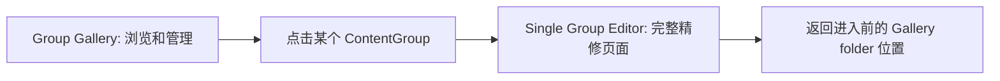
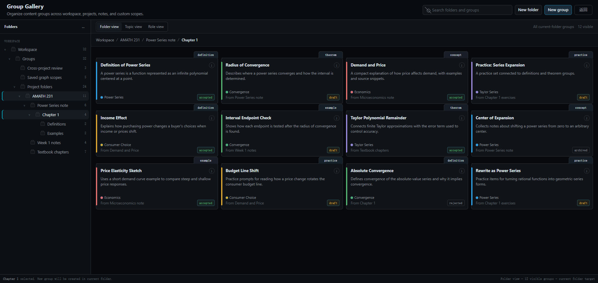
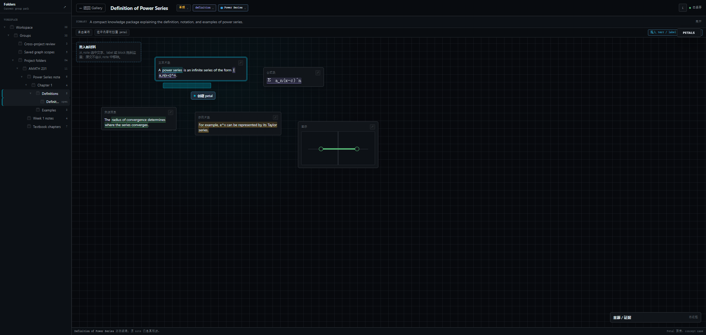
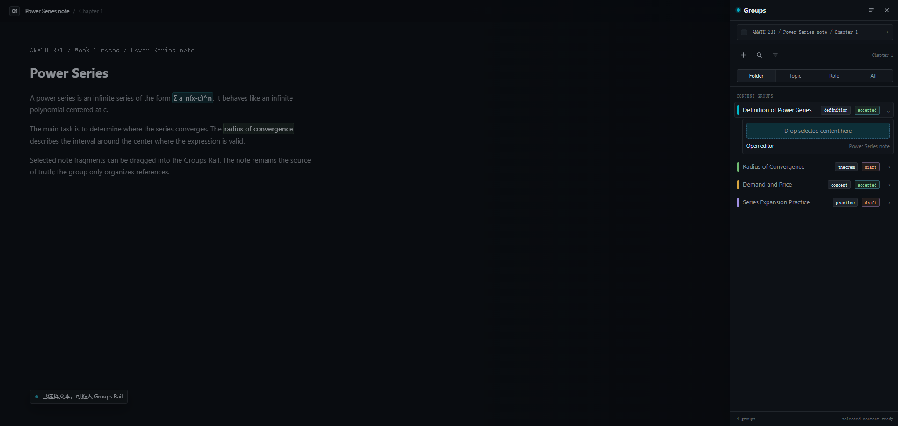
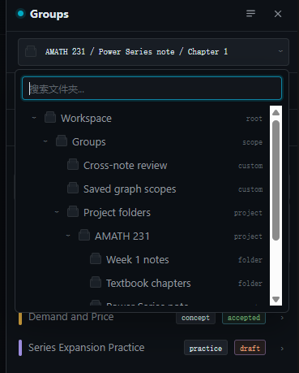
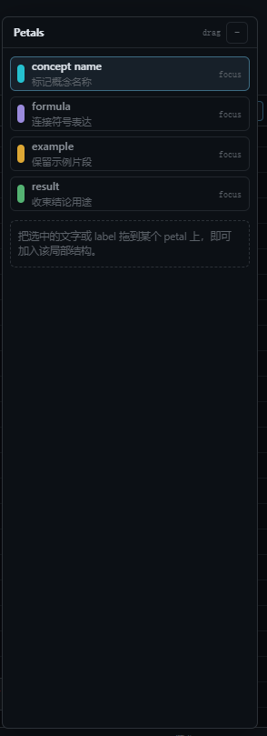
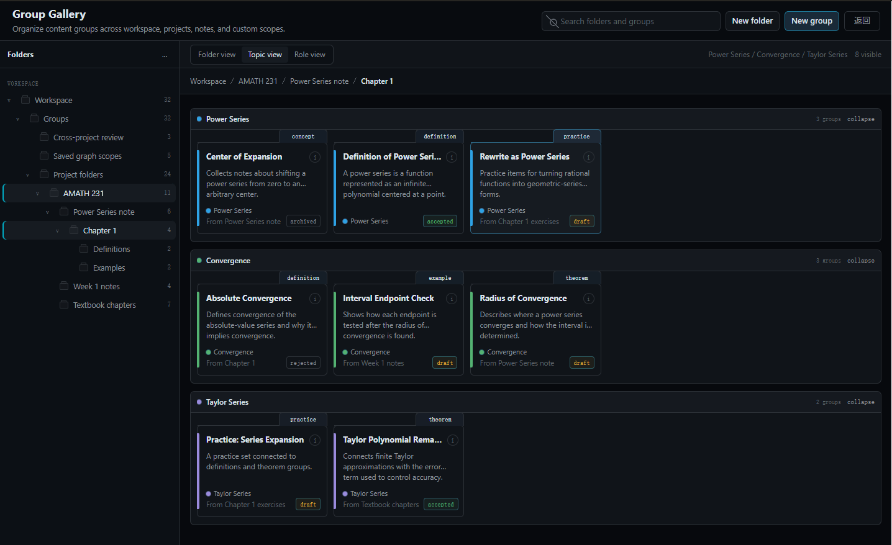
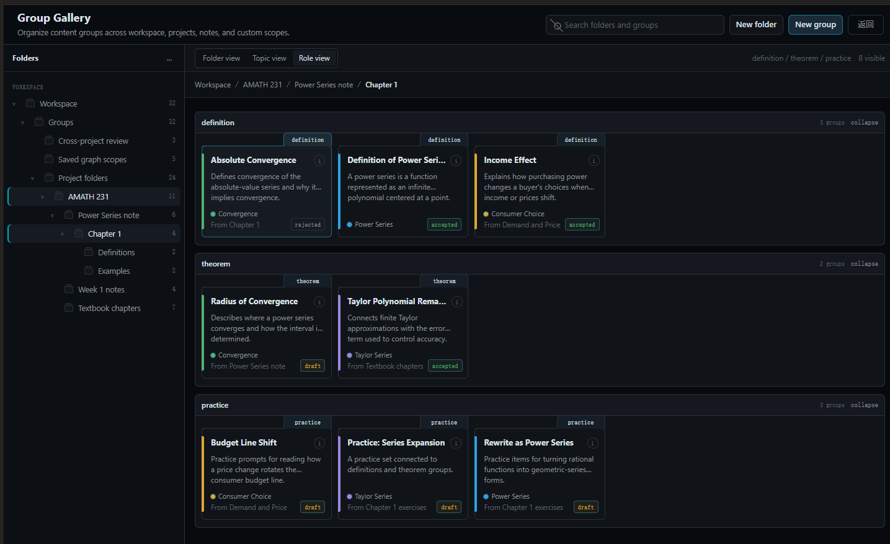
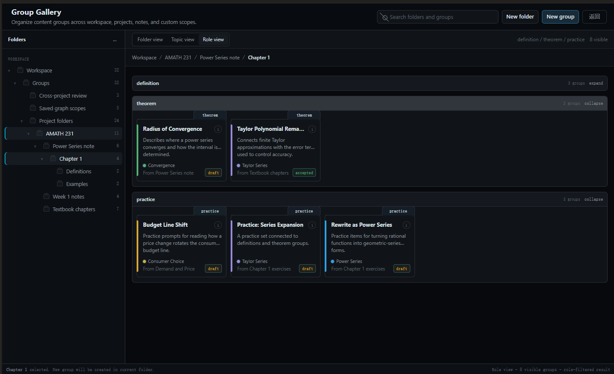
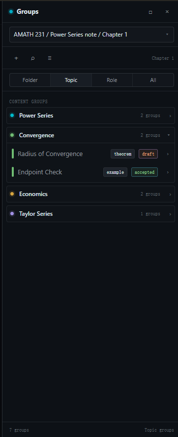

# 2026-06-20 Better Notebook / ContentGroup 反思会议记录

> 这是一份当天的活文档。
> 记录目标不是立刻下最终结论，而是把今天关于 Better Notebook、ContentGroup、GroupFolder、AI 阅读、用户工作流的反思逐步沉淀下来。想到哪里说到哪里，值得保留的判断就先记在这里，后续再统一整理进正式产品文档或版本计划。

## 1. 总体反思起点

Coincides 不应该被理解为单纯笔记软件，而是一个“精加工的信息处理平台”。

它处理的不是孤立文本，而是一条从原始资料到可追溯知识网络的链路：

```text
原始文档
  -> 可追溯笔记
  -> 可整理知识块
  -> 可建立关系的知识网络
  -> AI 可读取、可辅助推理的系统
```

这里最重要的根是：笔记内容必须能直接或间接追溯回原始资料。

- 直接追溯：copy、quote、引用原文片段。
- 间接追溯：paraphrasing、总结、改写，但仍应保留来源路径。

Better Notebook 的位置不是最终形态，而是 AI 和图结构真正进入之前的人类侧地基。它先要解决一个问题：用户能不能把 Coincides 当成一个真正舒服的笔记软件来写、读、改、整理。

## 2. Better Notebook 的优先级

Better Notebook 的优先级应该是：

```text
自然写作
  > 基础整理
  > 精细整理
  > 可被 AI 读取
  > 可进入 relation
```

如果用户一上来就面对大量工程结构，那么方向会偏。整理系统应该在用户需要时出现，而不是反过来压迫写作。

因此 Better Notebook 的第一原则仍然是：

```text
平时像普通笔记。
整理时像信息工作台。
深度编辑时像知识加工台。
```

## 3. Label 的定位

Label 是最表层的整理。

它不是“知识对象本体”，而是用户把分散信息在视觉上圈出来的方式。

Label 可以表达：

- 这里是一个 definition。
- 这里是一个 example。
- 这里我觉得重要。
- 这几段虽然分散，但我想把它们一起看。

所以 label 的主要价值是：

- 高光。
- 标记。
- 视觉提示。
- 未来整理的抓手。

它不应该背负过重的结构责任。Label 可以成为 ContentGroup 的输入来源，但它本身不等于 ContentGroup。

## 4. ContentGroup 的用户心智

ContentGroup 从用户视角看，不是“创建数据对象”，而是：

```text
把笔记里的碎片收进一个整理盒。
```

用户很容易理解这件事：

- 我把几段相关内容放到一起。
- 我把某个 label 收进一个盒子。
- 我把某个 block 或未来的图片、table 局部放进一个盒子。
- 我给这个盒子起个名字。
- 我告诉自己它大概是什么。
- 如果需要，我再把盒子内部细分。

ContentGroup 的意义有两层：

### 对人

帮助用户把散落内容整理成一个知识单元，辅助复习、预习、写作、推理。

### 对 AI

告诉 AI：这些内容被用户或系统认为属于同一个重点区域。AI 可以优先阅读、归纳、解释、建立 relation。

因此 ContentGroup 是从“视觉标记”进入“知识整理”的关键层。

## 5. ContentGroup 的轻量工作流

ContentGroup 的创建不应该一开始就进入完整表单或完整 editor。

更自然的顺序是：

```text
先收纳
  -> 再命名
  -> 再补 topic / role / identity
  -> 最后才进入 petal 精加工
```

也就是说：

```text
收纳优先，结构后置。
```

这和前面形成的产品哲学一致：知识不是被输入成结构的，而是逐渐被结构化的。

## 6. Groups Rail 的定位

用户正在 note 中写作或阅读时，可以点击右侧 `Groups` 按钮打开侧边栏。

这个侧边栏应该是轻量的 local group 收纳区。

它的职责：

- 显示当前 note 里的 local groups。
- 允许快速新建 group。
- 允许把选区、label、block 等内容快速丢进 group。
- 允许快速查看某个 group 里大概收了什么。
- 提供进入完整 Group Gallery / Single Group Editor 的路径。

它不应该承载复杂表单，也不应该成为完整编辑台。

Rail 的重点是：

```text
快、轻、不打断阅读和写作。
```

## 7. ContentGroup 的基础身份

ContentGroup 需要一些轻量身份信息，但这些信息不应该让用户感觉自己在填写工程 metadata。

可以理解为：

- `display name`：这个整理盒叫什么。
- `topic`：它具体关于什么。
- `role` / `type`：它在这篇笔记里扮演什么功能角色。
- `identity`：它当前是草稿、已确认、归档等状态。

用户的自然理解应该是：

```text
这个盒子叫 Power Series Definition。
它属于 Power Series。
它是一个 definition。
我确认它是有效的。
```

而不是：

```text
我要填写 ContentGroup metadata。
```

视觉上可以继续沿用之前的方向：

- display name 是标题。
- topic 像主题标签、颜色线索、路径信号。
- role 更像小 type / badge。
- identity 更像状态图标。

## 8. Petal 的定位

Petal 是 ContentGroup 内部的细分。

如果 ContentGroup 是一个整理盒，Petal 就是盒子里的分隔层。
如果用工程语言，它接近局部 slot，但不应该变成全局固定 schema。

例如一个 definition 类型的 ContentGroup 里，Petal 可能是：

- concept name
- concept description
- formula
- example
- diagram
- remark

Petal 回答的问题是：

```text
这个内容包里面，每一部分分别承担什么功能？
```

用户可能的操作方式：

- 新建 Petal。
- 把 group 里的 member 拖进 Petal。
- 把 member 内部的局部选区加入 Petal。
- 在 group editor 中选中内容，右键 `Add to Petal` / `Create Petal from selection`。

这里的核心是：

```text
先粗收纳，再细分拣。
```

## 9. 三个界面的分工

ContentGroup 相关能力至少需要三个层级的界面，它们不能混在一起。

### Groups Rail

快速收纳、快速查看、当前 note 的 local groups。

### Group Gallery

像资源管理器一样管理所有 groups、folders、跨 note / project 的整理视图。

### Single Group Editor

像精加工台一样，处理一个 group 内部的 members、Petals、身份、整理结构。

如果三个界面的职责混在一起，用户会感到混乱。

当前最重要的设计约束是：

```text
不要让用户在创建 group 的第一秒就面对完整 editor。
```

第一秒只做收纳。
第二步才做身份。
第三步才做花瓣。

## 10. GroupFolder 的定位

GroupFolder 是 ContentGroup 的资源管理器。

它解决的问题是：

```text
这些 ContentGroup 放在哪里？
怎样浏览？
怎样组织？
怎样跨 note / project 整理？
```

它不负责定义 ContentGroup 自身的语义。

Project 和 Note 都应该有自己的 root folder。除此之外，用户也可以创建跨 note、跨 project 的 group folder，用来整理跨范围的内容。

这会给未来 relation 留出空间：

- relation 不一定只发生在同一篇 note 内。
- relation 可以发生在一个跨 note / project 的 folder 视图里。
- AI 也可以临时生成某个主题的 folder / gallery，用于展示某个主题下的知识网络。

## 11. 当前体系的一句话总结

当前体系可以暂时总结为：

```text
原始资料是来源真相。
TextFlow 是笔记内容真相。
Label 是视觉标记。
ContentGroup 是知识整理包。
Petal 是包内局部结构。
GroupFolder 是整理包的资源管理器。
Relation 是这些整理包之间的逻辑关系。
```

关键原则：

```text
ContentGroup 引用原文，不搬走原文。
```

它是整理映射，不是破坏性复制。

## 12. 当前需要继续反思的问题

- 用户创建 ContentGroup 的最轻路径到底应该是什么？
- Groups Rail 里哪些内容必须显示，哪些必须隐藏到右键菜单或完整 editor？
- Topic / role / identity 的视觉表达是否已经足够自然？
- Petal 的创建和内容分配，怎样避免变成复杂表单？
- Label 到 ContentGroup 的转化是否足够顺滑？
- Draft Range、Label、Block、未来 image / table region 作为 ContentGroup member 时，是否应该在 UI 上被统一对待？
- GroupFolder 如何在 project / note root folder 和跨 scope folder 之间保持简单？
- AI 生成 ContentGroup 时，用户如何审查、修改、接受或拒绝？
- ContentGroup 什么时候才应该进入 relation？

## 13. Petal 命名与“花”隐喻

当前暴露出的第一个问题是：`Petal` 这个名字有点过于浪漫。

从工程含义看，Petal 的职责比较清楚：它是 ContentGroup 内部的局部角色，接近早期讨论里的 `slot`，用来说明某个内容片段在这个 group 中扮演什么角色。

例如一个 definition 类型的 ContentGroup 里，Petal 可以是：

- concept name
- concept description
- formula
- example
- diagram

但是从用户视角看，如果用户直接打开一个 ContentGroup，看到里面有一个叫 `Petal` 的概念，可能会困惑：

```text
为什么一个 ContentGroup 里会有花瓣？
```

因此这里有两条路线：

### 路线 A：工程化命名

把 Petal 改回更直白的名字，例如：

- Slot
- Part
- Field
- Section
- Component
- 组成部分
- 结构项

优点是直白、低学习成本。
缺点是气质更工程化，也比较普通。

### 路线 B：顺着 Petal 往前推，形成“花”的产品隐喻

如果 ContentGroup 内部的细分角色叫 Petal，那么 ContentGroup 本身就可以被理解成一朵花。

对应关系可以是：

```text
ContentGroup = 一朵花 / 一个花苞 / 一个内容花束
Petal = 花瓣 / 这朵花内部的组成部分
GroupFolder = 花圃 / 花园
Relation = 把花串起来的线 / 藤蔓 / 生长出来的连接
```

这条路线的价值是：

- 用户更容易通过隐喻理解“一个 group 由多个 petal 组成”。
- 产品气质会更鲜明，不只是工程工具。
- 未来视觉设计可以自然引入花、花瓣、花园、藤蔓、串联等元素。
- 动画设计也可以围绕“收集、展开、绽放、连接”展开。

它也能和当前功能形成某种歪打正着的呼应：

```text
散落内容 -> 收进一朵花
粗糙内容包 -> 拆成花瓣
多个 group -> 花圃 / 花园
relation -> 花之间的连接
```

这条路线的风险是：

- 隐喻不能过度，否则会让用户觉得漂亮但不确定怎么操作。
- 工程文档和用户界面需要分层命名，避免内部实现也被隐喻拖得不清晰。
- 不能为了隐喻牺牲信息密度和操作效率。

当前倾向：

```text
相比把所有名称重新工程化，更倾向于保留并发展“花”的隐喻。
```

但这个隐喻必须服务于理解和操作，而不是只服务于装饰。

## 14. Petal 与旧 Child Label 的关系

Petal 目前承担的职责，其实继承了一部分早期 `annotation first` 阶段对 child label 的设想。

早期 child label 的优点是：它可以在正文视觉层面显化。

例如一个 label 的全文是一个 definition，那么其中：

- concept name
- concept description
- example

都可以作为 child label，在正文高光区域里显示自己的小 badge。这样用户能以最低成本看到：

```text
这小段内容在当前 label / group 里扮演什么角色。
```

现在 Petal 已经替代了 child label 的结构职责，但还没有继承 child label 的视觉优点。

因此后续要考虑：

- Petal 是否应该能在正文中显化？
- 是否至少在 hover 时显示当前片段属于哪个 Petal？
- 是否需要一个 Structure View，显示 label / ContentGroup / Petal 的结构高光？
- 是否需要一个 Clean View，隐藏所有 label 和 Petal，只保留干净正文？

一个暂时合理的方向是：

```text
Petal 不默认全局裸露。
Petal 只在 active ContentGroup 或结构视图中显化。
```

这样可以保留 child label 的轻量视觉优点，同时避免正文被大量结构标记污染。

## 14.1 Petal 的核心价值：让 ContentGroup 可复用

进一步反思后，Petal 的定位变得更清楚：

```text
ContentGroup 让重点内容成组。
Petal 让重点内容可复用。
```

ContentGroup 的意义是把相关重点内容打包成一个可整理、可阅读、可引用的知识包。

Petal 的意义不是让人类每次整理时多做一步，而是提升这个知识包在未来被 AI 读取、复用、重组、解释、建立 relation 时的价值。

从人类侧看，Petal 可以被理解为：

```text
属于某一个 ContentGroup level 的 label。
```

它可以告诉用户：

- 这部分是 concept name。
- 这部分是 description。
- 这部分是 formula。
- 这部分是 example。
- 这部分是 result。

但这种视觉提示只是 Petal 的次要价值。

Petal 更重要的意义在数据结构层和 AI 加工层：

- AI 重新读取 ContentGroup 时，不需要再猜哪部分是什么。
- AI 复用 ContentGroup 生成复习笔记时，可以直接提取 concept name / description / example。
- AI 扩写新章节或重新组织材料时，可以把已有 Petal 当成更高质量的结构线索。
- AI 做 relation 分析时，可以更精确地区分一个 ContentGroup 内部的局部角色。

因此 Petal 可以被定义为：

```text
Petal 是 ContentGroup 内部的结构性 label。
它把 group 中的 member 或 member 局部标记为某种局部角色，
从而提升这个 ContentGroup 被 AI 复读、复用、重组和关系分析的能力。
```

这里要区分三层：

```text
普通 Label
  作用范围：正文 / note surface
  主要意义：视觉标记、人工阅读提示、轻量整理抓手

ContentGroup
  作用范围：一组重点内容
  主要意义：把相关内容打包成可复用知识包

Petal
  作用范围：某一个 ContentGroup 内部
  主要意义：标注这个知识包内部各部分的局部角色
```

由此形成一个产品原则：

```text
Petal 对 AI 是高价值结构。
Petal 对人类是可见但可选的精细标记。
```

因此 UI 上不应该强迫用户创建 Petal。
人类当然可以整理 Petal，但更自然、更低成本的路径是由 AI 生成 Petal proposal，再由用户审核、删除、改名、合并、拆分。

Petal 可以像 group 内部 label 一样显化，但它必须依附于某个 ContentGroup，不应该脱离 group 独立存在。

## 15. Group Gallery 走查：当前实现暴露的问题

从用户视角打开当前 Group Gallery，会暴露出几个明显问题。这些问题不是单纯视觉 polish，而是信息架构和界面职责分配的问题。

### 15.1 Folder 树的层级逻辑不对

当前界面中出现了类似：

```text
CG TEST
  Workspace groups
  Project groups
  Note groups

Untitled note
  Workspace groups
  Project groups
  Note groups
```

这会让用户困惑，因为 `CG TEST` 和 `Untitled note` 看起来像 ContentGroup，却又在它们下面出现 workspace / project / note groups。

正确逻辑应该是：

```text
Workspace groups
  Project groups
    Project A
      Note groups
        Note A
          Folder / Subfolder
```

或者至少在当前版本中，左侧只负责定位到：

```text
workspace / project / note / folder
```

右侧主区域再显示当前 folder 下有哪些 ContentGroups。

硬判断：

```text
ContentGroup 不应该出现在 folder 树里作为 folder 的上级。
Folder tree 只表达位置、目录、范围。
ContentGroup 应该显示在右侧主内容区域。
```

### 15.2 Group Gallery 的卡片过大

当前 ContentGroup preview card 尺寸过大，并且把太多正文内容直接塞进卡片里。

这导致它更像一个被截断的文档块，而不是一个用于浏览和管理的知识卡片。

15:10 会议记录中已经明确过：

```text
Gallery 里的每个 ContentGroup 是卡片，不是表单。
```

卡片应该主要承担快速识别功能，而不是让用户在 Gallery 里读完整内容。

合理卡片应包含：

- display name：主标题。
- 短 preview：最多几行 summary 或 member preview。
- role tab / type badge。
- topic signal：颜色、细边线、小角标、路径。
- identity icon：draft / accepted / rejected / archived。
- members / petals 数量。

不应该把大段正文常驻塞进卡片。

### 15.3 Role / Topic 视觉语义还没有落地

15:10 会议记录中已经确定过：

```text
Role = folder tab / type badge
Topic = color / corner mark / path
Identity = icon badge
Depth = folder hierarchy
```

当前实现中，topic 和 role 仍然像两个并排表单字段。

这会让用户无法一眼理解：

- role 是这个 ContentGroup 在笔记中的功能类型。
- topic 是这个 ContentGroup 具体关于什么。

更合适的视觉方向：

- `role` 展示为小 type / badge / tab，例如 Definition、Example、Theorem。
- `topic` 展示为主题信号，例如颜色、路径、小角标、细边线。
- `identity` 展示为状态图标或状态 chip。

### 15.4 Single Group Editor 不应该常驻 Gallery 右侧

当前 Group Gallery 右侧提前预留了 `Single Group Editor` 栏。

这违背了三层界面的职责分工：

```text
Groups Rail = 快速收纳。
Group Gallery = 浏览、管理、批量整理。
Single Group Editor = 单个 ContentGroup 的深度精加工。
```

Single Group Editor 不是 Gallery 的右侧栏。它应该是一个完整页面，和 Group Gallery 平级。

推荐关系：



硬规则：

```text
Gallery 只浏览和管理，不做深度编辑。
Single Editor 才做深度编辑。
```

Gallery 可以提供轻量 preview / inspector，但不能把完整 editor 塞进右侧。

### 15.5 Summary 不应该常驻大 textarea

当前 summary 以大 textarea 的形式常驻在编辑区域中，占用大量空间。

但从用户工作流看，summary 大概率不是用户频繁编辑的主信息。

更合理的位置：

```text
display name 下方
可展开 / 可折叠
默认轻量展示
```

Summary 可以服务于：

- 用户快速理解这个 group。
- AI 后续读取 group 时的摘要提示。

但它不应该在默认界面里压过 members、petals 和核心身份信息。

### 15.6 Title 不应该重复

当前 Single Group Editor 中，标题展示和标题输入存在重复：

```text
顶部显示 title
下面又有一个 title input
```

更合理的处理：

- 顶部标题本身可编辑。
- 点击标题进入编辑状态。
- 失焦或按 Enter 自动保存。
- 不再额外显示一个重复 title input。

### 15.7 Identity 应该是状态选单，不是摊开的按钮组

当前 identity 操作把 Draft / Accept / Reject 等按钮铺在界面上。

这会带来两个问题：

- 占空间。
- 让状态切换显得像一组主要操作，而不是当前对象的状态属性。

更合理的方式：

```text
[Draft ▾]
```

点击后打开状态选单：

- Draft
- Accepted
- Rejected
- Archived

如果当前状态是 Accepted，则显示：

```text
[Accepted ▾]
```

状态本身应该是一个 chip / icon / selector，而不是一排常驻按钮。

## 16. 当前新增硬规则

这次走查后新增一条硬规则：

```text
Gallery 只浏览和管理，不做深度编辑。
Single Group Editor 才做深度编辑。
```

由此推出：

- Gallery 是资源管理区，不是编辑器。
- Gallery 左侧只做 folder / scope / path 定位。
- Gallery 主区域显示当前范围下的 ContentGroup cards / rows。
- Gallery card 用于快速识别，不用于长文本阅读。
- Single Group Editor 必须是完整页面，而不是 Gallery 的右侧栏。
- Groups Rail 是 note 内快速收纳入口，也不是完整编辑器。

三个界面的职责必须钉死：

| 界面 | 职责 | 不应该做什么 |
|---|---|---|
| Groups Rail | 快速收纳、快速查看当前 note local groups | 不做完整表单，不做深度 Petal 编辑 |
| Group Gallery | 浏览、管理、批量整理、folder / topic / role 视图 | 不常驻完整 Single Editor |
| Single Group Editor | 单个 ContentGroup 的深度精加工 | 不承担全局 folder 浏览职责 |

这条规则优先级高于当前实现。

## 17. Single Group Editor 的质变：从表单页到内容工作台

进一步反思后，当前改动最大的界面应该是 `Single Group Editor`。

它不应该继续被理解为一个右侧表单，也不应该在页面上反复强调自己叫 `Single Group Editor`。

用户点击进入某个 ContentGroup 后，自然知道自己正在编辑这个 group。就像用户打开一个文件夹时，界面不需要用边框告诉他“这是文件夹”；用户打开 Word 文档时，也不需要每一页都显示 Word 的品牌标识。

因此页面上不需要常驻强调：

```text
Single Group Editor
```

更合理的心智是：

```text
我进入了这个 ContentGroup 的内部工作台。
```

页面顶部应该围绕当前 ContentGroup 本身展开：

- display name，可直接点击编辑。
- identity chip，可下拉切换状态。
- topic signal。
- role / type badge。
- summary 折叠预览。
- 返回 Group Gallery 的路径。

标题展示和标题输入不应该重复。标题本身可以是可编辑文本，用户点击后进入 rename，失焦或按 Enter 自动保存。

## 18. Members 应该散落在工作台上，而不是表单列表里

Single Group Editor 的主区域应该从列表表单转向 canvas 工作台。

用户进入 group 以后，第一眼应该看到：

```text
我刚刚丢进来的内容都在这里。
```

而不是看到：

```text
Members
Content range
Paragraph
New petal
```

`Members`、`Content Range`、`Paragraph` 这类词更偏工程。系统当然需要知道 source 类型和 locator，但普通用户第一眼不需要看到这些内部分类。

更自然的方式是：

```text
ContentGroup 内部画布
  - text range piece
  - label piece
  - block piece
  - image piece
  - table region piece
```

这些 pieces 像整理素材一样散落在一个工作台上。用户可以：

- 拖动位置。
- 放大或缩小某个 piece。
- 折叠过长内容。
- 把相关片段放近。
- 把整个 piece 标成 Petal。
- 框选 piece 内部文字，创建 Petal。

这会比当前“卡片堆卡片”的表单列表更接近用户心智。

这里要明确区分两种位置：

```text
Member source locator
  真相位置，指向原文 / 原 note / 原 block / 原 source。

Member editor placement
  工作台位置，只服务于用户整理和阅读。
```

AI 阅读 ContentGroup 时，重点应该读 source locator、summary、petal、role、topic、identity 等结构字段。
Single Group Editor 里的 canvas 坐标可以保存，但它不是语义真相。

## 19. Petal 应该从内容中长出来，而不是从按钮里凭空创建

当前底部 `New petal` 按钮容易造成认知混乱：

```text
我已经把内容都装进来了，为什么还要新建 petal？
Petal 是不是必填？
不创建是不是 group 不完整？
```

更自然的流程是：

```text
用户先看到某个 member 或 member 内部片段。
用户发现这部分是 concept name / description / example。
用户选中它。
右键或快捷操作：Create Petal / Mark as Petal。
```

也就是说：

```text
Petal 从内容中长出来，而不是从空按钮里凭空创建。
```

Petal 的创建入口应该优先来自：

- 选中整个 member。
- 选中 member 内部一段文字。
- 多选几个 pieces。
- 把内容拖到某个已有 Petal 区域。

`New petal` 可以保留为低频入口，但不应该是主要路径，也不应该在界面上制造“必须创建 petal”的压力。

## 20. Summary 的定位：AI 侧复用优先，用户侧预览辅助

Summary 的定位也变得更清楚。

它和 Petal 类似，更多是 AI 侧高价值，人类侧次价值。

用户已经完成了：

```text
写笔记
选内容
建 label
把内容丢进 ContentGroup
```

这本身已经是人类侧的精加工。大多数用户不会再主动勤勉地手写 summary。

因此 summary 更自然的来源是 AI：

```text
AI 为这个 ContentGroup 生成摘要。
用户可以修改，但不被强迫填写。
```

Summary 的用途：

- AI 读取 group 前先读 summary。
- Group Gallery card 的 preview。
- 用户快速回忆这个 group 是什么。

因此 summary 不应该以大 textarea 常驻主编辑区。更合理的形式是：

```text
display name 下方
短 preview
可展开 / 可折叠
必要时可编辑
```

## 21. Group Gallery 卡片应该服务快速识别

Group Gallery 中的卡片不应该承载完整正文阅读。

它应该帮助用户快速判断：

```text
这是什么？
属于什么主题？
是什么角色？
当前状态是什么？
大概收了多少内容？
```

推荐信息结构：

- display name：主标题。
- summary preview：短预览。
- topic signal：颜色、角标、路径或细边线。
- role / type：小 tab、竖签或 badge。
- identity：状态 chip / icon。
- folder path。

也就是说：

```text
Gallery card 是知识卡片，不是内容全文预览。
```

`member count`、`petal count`、source health、created / updated 等系统信息不应该出现在卡片封面上。

这些信息除了 AI、debug 或少数高级检查场景外，普通用户大概率不会关心。它们可以放进一个很轻的 `ⓘ` 信息入口里。

推荐规则：

```text
封面展示识别信息。
ⓘ 展示系统信息。
```

`ⓘ` 可以放在 Single Group Editor 顶部栏不显眼的位置，或 Gallery card hover 时出现。

## 22. GroupFolder 的意义：让 ContentGroup 成为可复用单位

GroupFolder 不只是整理 ContentGroup 的目录。

它的加入会让 ContentGroup 升级为可复用的独立单位。

关键变化是：

```text
ContentGroup 不应该被某一篇 note 绑死。
ContentGroup 可以被放进某个 note / project / workspace 的 GroupFolder 中。
```

这会自然支持 cross-note / cross-project 的整理。

但这里需要区分两种非常不同的复用：

```text
普通复用
  用户把一个 ContentGroup 拿到另一个 note / project 里继续加工。
  默认应该是 Duplicate，生成独立副本。

高级引用
  用户只是希望在另一个 folder / view 中也看到同一个 ContentGroup。
  这更像 shortcut / view entry，不应该作为普通复用默认行为。
```

因此 GroupFolder 的能力不应该被简单理解成“同一个 ContentGroup 可以随便出现在多个 folder 里并被到处编辑”。

更稳的规则是：

```text
ContentGroup 是可加工素材。
跨上下文普通复用默认复制。
引用只用于索引、收藏、视图和非破坏性浏览。
```

也就是说，GroupFolder 既可以管理本地 ContentGroups，也可以承载高级引用入口，但用户把 ContentGroup 拿去另一个 note 中加工时，默认心智应该是“复制到这里”，而不是“共享同一个对象”。

## 23. 数据结构需要支持“本体”和“放置”分离

为了支持上面的交互，数据结构上必须区分：

```text
ContentGroup 本体
  它是什么，它叫什么，它有哪些 members / petals / summary / topic / role / identity。

GroupFolder placement
  它被放在哪个 folder 里，或作为高级引用入口出现在哪些 folder / view 里。

ContentGroup member source locator
  每个 member 原始来自哪里。

Member editor placement
  这个 member 在 Single Group Editor 工作台里的位置。
```

因此需要避免把 ContentGroup 简单理解成“某个 note 下的对象”。

但也要避免把普通跨 note 复用默认做成共享引用。

更合理的基础模型是：

```text
ContentGroup
  id
  display_name
  topic
  role
  identity
  summary
  members[]
  petals[]
  derived_from_group_id?

ContentGroupPlacement
  group_id
  folder_id
  placement_kind: owner | shortcut | view_entry

ContentGroupMember
  id
  group_id
  current_content
  direct_source_locator
  direct_source_snapshot
  root_evidence_links[]
  member_kind

MemberEditorPlacement
  member_id
  x
  y
  width
  height
  collapsed
```

这可以支持：

- 一个 ContentGroup 作为高级引用入口出现在多个 folder / view。
- 普通跨 note 复用时生成独立副本，并通过 `derived_from_group_id` 追溯母本。
- 一个 ContentGroup 包含来自多个 note 的 members。
- Single Group Editor 内部自由排版。
- 原文不被移动。
- AI 仍然可以通过 direct source 和 root evidence 追溯内容。

## 24. Cross-note 复用的正确理解

如果用户在 Note B 中把 Note A 里产生的 ContentGroup 拿来继续加工，默认不应该理解为“在 Note B 中编辑同一份共享对象”。

更符合用户心智的是：

```text
把素材复制到这里，成为当前 note 里的可加工副本。
```

因此普通跨 note / cross project 复用默认应该是 Duplicate。

Duplicate 后的新 ContentGroup：

- 有自己的 id。
- 可以独立修改。
- 不影响母本 ContentGroup。
- 母本删除后，副本仍然存在。
- 保留 `derived_from_group_id`。
- 保留 members 的 direct source / root evidence / snapshot。

如果用户在 Note B 里选中一段文字，把它加入这个副本 ContentGroup，这不应该理解为“把 Note B 的文字搬到 Note A”。

正确理解是：

```text
Note B 的 text range
  -> 作为 member 加入 ContentGroup X copy
  -> ContentGroup X copy 可能 derived from Note A 中的 ContentGroup X
  -> 这个 member 的 source locator 指向 Note B 的原文位置
```

因此 ContentGroup 会逐渐成为跨材料知识包。

它可以收纳：

- 来自当前 note 的 text range。
- 来自其他 note 的 text range。
- 来自 label 的多个 ranges。
- 来自 block 的内容。
- 未来来自 image / table / source region 的内容。

这非常符合 Coincides 的总目标：

```text
精加工信息处理平台，而不是单篇文档编辑器。
```

当前总结：

```text
Group Gallery 是 ContentGroup 的资源管理器。
Single Group Editor 是某个 ContentGroup 的 canvas 工作台。
ContentGroup 是独立知识载体，但带来源链。
GroupFolder 决定它作为本地对象或高级入口出现在哪里。
普通复用默认 Duplicate，不默认共享引用。
Member 保存当前内容、direct source、direct source snapshot 和 root evidence chain。
Petal 和 Summary 提升它未来被 AI 复用的价值。
```

## 25. Duplicate、Reference、Materialize 的边界

后续反思中进一步明确：`引用` 不应该作为 ContentGroup 普通复用的默认心智。

ContentGroup 更像可加工素材，不像 Windows 上的 exe 快捷方式。

快捷方式适合：

```text
我只是想从另一个地方打开同一个东西。
```

但 ContentGroup 一旦被拿到另一篇 note 里，很自然会发生：

- 改写。
- 裁剪。
- 合并。
- 拆分。
- 补过渡句。
- 改 display name。
- 改 topic / role。
- 重新整理 Petal。
- 根据新 note 的上下文重新排布。

因此默认引用会违背素材心智。

当前推荐三种动作：

| 动作 | 用户语言 | 数据含义 | 是否产生新内容 |
|---|---|---|---|
| Duplicate | 复制到这里 / Make local copy | 生成独立 ContentGroup 副本 | 是 |
| Reference | 添加入口 / 加入视图 / shortcut | 只是让另一个 folder / view 也能看到同一份 group | 否 |
| Materialize | 插入正文 / 铺到笔记里 | 按 members 生成 note blocks / ranges | 是 |

硬规则：

```text
普通复用 = Duplicate。
正文复用 = Materialize。
高级整理视图 = Reference / Shortcut。
```

用户想“拿来改”，就复制。
用户想“在这里也看见它”，才引用。

## 26. ContentGroup 的独立性：独立内容，带链路，不自动同步

ContentGroup 需要同时满足两个看似矛盾的特性：

```text
它是独立知识载体。
它又带有来源链。
```

这可以通过 member 的三层内容模型解决。

一个 ContentGroupMember 至少需要包含：

```text
member 当前内容
  ContentGroup 里现在显示、复用、被 AI 读取的内容。

direct source locator
  它最初从哪篇 note 的哪个 ContentRange / block / range 来。

direct source snapshot
  它被加入 ContentGroup 那一刻，direct source 当时长什么样。

root evidence chain
  这段 note 内容最初依据哪些原始文档、PDF、网页、source snapshot。
```

最初创建 member 时：

```text
member 当前内容 = direct source snapshot = direct source 当前内容
```

之后它们可以分开演化。

如果用户在 ContentGroup 里修改 member：

```text
member 当前内容改变。
direct source 不变。
direct source snapshot 不变。
```

如果用户修改原 note：

```text
direct source 当前内容改变。
member 当前内容不自动改变。
direct source snapshot 不自动改变。
```

因此规则是：

```text
Source change does not mutate ContentGroup snapshot.
ContentGroup edit does not mutate source note.
Duplicate produces an independent copy.
```

可能状态：

```text
synced
  member 当前内容 = snapshot = direct source 当前内容。

member_edited
  member 当前内容 != snapshot。

source_changed
  direct source 当前内容 != snapshot。

both_changed
  member 改过，source 也改过。

direct_source_missing
  direct note/range 被删除，只剩 snapshot 和可能的 root evidence。

root_source_missing
  原始证据链也断了，只剩 snapshot。
```

这意味着：

- 修改原 note，不自动修改母本 ContentGroup 或副本 ContentGroup。
- 修改母本 member，不自动修改原 note 或副本。
- 修改副本 member，不自动修改原 note 或母本。
- 删除原 note，ContentGroup 仍可保留内容，但 direct source 变 missing。
- 删除母本，副本仍然存在，但 `derived_from_group_id` 指向的来源变 missing。
- root evidence 还在时，仍然可以追溯到原始文档。

一句话：

```text
ContentGroup member 保存内容快照和来源链。
来源变化不自动改 ContentGroup。
ContentGroup 修改不自动回写来源。
Duplicate 产生独立副本。
副本保留来源链和 derived_from，但不和母本同步。
```

## 27. AI 生成任务中的 Review Patch

默认情况下，ContentGroup 不做双向写回。

但是 AI 生成 note 的场景需要单独处理。

当用户给出三篇原始文档，要求 AI 整理成一篇 note 时，AI 可能会同时生成：

```text
Note 页面上的正文 / blocks / layout
ContentGroups
Petals
summary
source links
```

这些并不是普通的 source/member 关系，而是同一次 generation result 的多个投影。

因此可以引入：

```text
GenerationRun
  source_ids
  target_note_id
  generated_blocks[]
  generated_content_groups[]
  projection_links[]
```

`projection_links` 记录：

```text
note block/range <-> content_group member / petal
```

当用户指出：

```text
这个 definition 抽错了。
这里多抽了一段。
这里少了半个词。
这部分不应该属于 definition。
```

系统不应该做普通双向同步，而应该生成一次显式的 review patch：

```text
1. 定位 note 中被指出的问题区域。
2. 找到对应的 generated ContentGroup / member / petal。
3. 生成 patch proposal。
4. 用户确认后，同时更新 note projection 和 ContentGroup projection。
5. 保留 source locator 和 evidence chain。
```

规则：

```text
默认不双向写回。
AI 生成任务内允许 review patch 同步。
同步必须是显式 patch，不是静默自动同步。
```

这样可以同时满足：

- 普通 cross-note 复用安全，不会乱同步。
- AI 生成后的用户纠错足够顺滑。
- note projection 和 ContentGroup projection 可以在同一 generation task 内一起修正。

## 28. Better Notebook 与 Better RAG 的边界

这次讨论里，一个重要的边界逐渐清楚了：

```text
Better Notebook 解决人类侧的写作、阅读、标记和基础整理。
Better RAG / GraphRAG 解决 AI 侧的读取、复用、证据追溯和关系攀爬。
```

从普通用户视角看，Better Notebook 走到自然写作、block/canvas、label 这一层时，其实已经接近“普通笔记软件”的完成态。
用户可以写、读、改、标记重点、把分散内容高亮出来。

但是从 Coincides 的长期目标看，这还不够。
Coincides 不是只做一款安静的笔记软件，而是要成为精加工的信息处理平台。
因此在 label 之后继续出现的 ContentGroup、Petal、GroupFolder、Relation，并不是普通笔记功能的简单加法，而是在为下一层能力铺地基：

```text
AI 可以读得更准。
AI 可以知道哪些内容已经被人类或 AI 认为重要。
AI 可以沿着来源、内容包、局部结构和关系继续推理。
人类可以从线性笔记里拉出局部知识图谱。
```

所以 Better Notebook 和 Better RAG 的关系可以这样理解：

```text
Better Notebook 是人类可用的笔记地基。
Better RAG 是 AI 可读、可复用、可追溯的结构地基。
GraphRAG 是这些结构真正连成知识网络后的下一层形态。
```

这也解释了为什么 ContentGroup 会显得“超出普通笔记”。
它不是为了让用户每写一句话都进行工程化整理，而是为了在用户或 AI 需要精加工时，能够把散落内容固定成可复用的知识材料。

一个阶段性判断是：

```text
Label 是 Better Notebook 的整理尽头之一。
ContentGroup 开始进入 Better RAG 的地基。
Relation 则是 GraphRAG 真正显形的开始。
```

这里要保持警惕：

```text
不能因为 AI 需要结构，就让人类写作被结构压迫。
```

因此默认体验仍然应该是：

```text
平时像普通笔记。
整理时像信息工作台。
深度加工时像知识加工台。
图谱展开时才像 GraphRAG 系统。
```

## 29. Relation Endpoint 的粒度：ContentGroup / Petal / ContentRange / Block

当 relation 被重新放回这套结构里，一个核心问题出现了：

```text
relation 的 endpoint 到底应该是什么？
```

候选对象至少有四类：

```text
ContentGroup
Petal
ContentRange
Block
```

如果 endpoint 只用 ContentRange，会非常精确，但图谱会爆炸。
一篇文章里会出现大量次重点片段、解释性片段、例子里的局部片段。
这些片段之间当然可能存在关系，但不是所有关系都值得成为用户默认看到的知识图谱。

如果 endpoint 只用 ContentGroup，又可能太粗。
一个 ContentGroup 里可能同时包含 concept name、description、formula、example、remark。
某些 relation 实际上只指向其中一个局部，而不是整个 ContentGroup。

因此更成熟的模型应该分层：

```text
ContentGroup 是默认知识节点。
Petal 是节点内部端口 / 子节点。
ContentRange 是证据锚点。
Block 是特殊对象节点。
```

这里要区分三件事：

```text
Addressable Object
  系统可以定位和引用的对象。

Graph Endpoint
  relation 可以连接到的对象。

Visible Graph Node
  默认在用户图谱里显示出来的节点。
```

不是所有可寻址对象都应该默认显示成节点。
ContentRange 可以成为 endpoint，但大多数时候它更适合作为证据锚点，而不是默认图谱节点。

阶段性规则可以这样定：

```text
默认显示：ContentGroup
展开显示：Petal
证据定位：ContentRange / SourceRange
特殊对象：Block / image / table / code / source snapshot
```

因此 relation endpoint 可以设计成一种统一引用：

```text
EndpointRef:
  target_type:
    content_group
    petal
    content_range
    block
    source_range

  target_id
  optional_subtarget_id
  evidence_locator
```

这样既保留精度，也避免默认图谱过细。

一个关键原则是：

```text
ContentGroup 负责让知识成块。
Petal 负责让块内知识可精确连接。
ContentRange 负责让连接可追溯。
Block 负责承载不能自然退化为文本范围的特殊对象。
```

这也意味着 relation 不是一定要从一个完整 ContentGroup 连到另一个完整 ContentGroup。
它可以是：

```text
ContentGroup -> ContentGroup
Petal -> ContentGroup
Petal -> Petal
ContentRange -> Petal
Block -> ContentGroup
SourceRange -> ContentGroup
```

但是在用户默认视图里，不应该把这些全部摊开。
图谱需要语义缩放。

## 30. Local Graph：从知识点拖出局部图谱

这次讨论重新找回了最初让这个产品变得迷人的愿景：

```text
用户从笔记里拖出一个知识点，
旁边展开一个围绕它的局部知识图谱。
```

这不是为了做一个抽象的全局知识图，而是为了让用户在阅读和学习时，能从线性笔记中召唤出一个局部关系视图。

例子：

```text
用户拖出一个 definition。

局部图谱显示：
definition -> theorem
definition -> example
theorem -> proof step
theorem -> application
application -> practice problem
```

这比单纯的线性笔记更贴近学习的真实过程。
学习不是只沿着一条线走，而是在脑内不断建立概念、例子、推导、应用之间的关系。

因此未来 relation 的默认产品形态不应该一开始就是巨大复杂的 global graph。
更合理的是：

```text
Local Graph First.
```

也就是说：

```text
用户在某篇 note 中选中一个知识点。
系统从这个 ContentGroup / Petal / ContentRange 找到对应 endpoint。
以它为中心展开 1-3 层 relation。
用户可以继续放大、收缩、跳转、保存这个视图。
```

这个 local graph 可以来自几种情况：

```text
AI 生成笔记时已经建立好的 relation。
用户手动建立的 relation。
AI 后续整理用户笔记时补全的 relation。
基于 source / folder / materialize / duplicate 推导出来的弱 relation。
```

这里的关键不是“图谱很炫”，而是：

```text
用户能从一个知识点出发，看到它为什么重要、依赖谁、支持谁、应用在哪里。
```

因此 relation 的名字也很重要。
它不只是线，而是思考过程的压缩表达。

例如：

```text
prerequisite_of
derived_from
example_of
supports
contrasts_with
applies_to
generalizes
special_case_of
```

这些 relation type / relation label 本身就保存了逻辑含义。
它会让图谱不只是连接点，而是把推理路径写下来。

## 31. GroupFolder 作为 Graph Scope

GroupFolder 原本是为 ContentGroup 做资源管理。
这次讨论里，它进一步获得了另一个意义：

```text
GroupFolder 可以成为 graph scope。
```

也就是说，它不仅告诉用户这些 ContentGroup 放在哪里，还可以告诉系统：

```text
当前图谱应该以哪些 ContentGroup 为候选范围。
```

例如：

```text
Note root folder
  只看当前 note 的内容图谱。

Project root folder
  看整个 project 下的内容图谱。

Custom cross-project folder
  看用户或 AI 临时整理出来的跨项目知识范围。
```

这对未来 cross-note / cross-project relation 非常关键。

比如用户问：

```text
把所有和 Power Series 有关的内容给我拉出来，生成一个图谱。
```

系统可以：

```text
1. 在多个 project / note 中找到相关 ContentGroup。
2. 临时创建一个 GroupFolder 作为 graph scope。
3. 把相关 ContentGroup 引入这个 scope。
4. 展开这些 ContentGroup 之间已有的 relation。
5. 如果 relation 不完整，则让 AI 生成 relation proposal。
6. 用户满意后，可以保存这个 folder / graph view。
7. 用户不满意，则作为临时视图丢弃。
```

因此 GroupFolder 不只是“文件夹”。
它在图谱层面也是一种范围声明。

一个可以保留的模型是：

```text
Folder decides what is in scope.
Relation decides how things are connected.
Graph View decides how much is visible.
```

这也让 semantic zoom 变得自然：

```text
Folder 层：当前知识范围
ContentGroup 层：默认知识节点
Petal 层：节点内部结构
ContentRange 层：证据锚点
SourceRange 层：原始来源
```

用户看到的是逐渐放大的图。
AI 读到的是逐渐精细的结构。

## 32. Agent 可调用的工作记忆结构

这套结构不只服务人类，也服务未来的 agent。

如果一篇报告有两百页，普通 agent 直接读取全文会很吃力。
但是如果它已经被整理成：

```text
GroupFolder
ContentGroup
Petal
Summary
Topic
Role
SourceChain
Relation
Identity
```

那么 agent 的工作方式会发生变化。

它不再只是“全文搜索 + 读一大段上下文”，而是可以这样工作：

```text
1. 定位 project / note / group folder。
2. 找到相关 ContentGroup。
3. 先读 summary、topic、role。
4. 判断哪些 ContentGroup 值得展开。
5. 读取 Petal，理解这个内容包内部的结构。
6. 沿 relation 向外爬 1-3 层。
7. 需要核实时，回到 ContentRange / SourceRange / source snapshot。
8. 基于这些结构继续回答、推理、生成新笔记或提出修改。
```

这本质上是在为 agent 准备一套可调用的工作记忆。

不同对象在 agent 视角中的作用：

```text
GroupFolder
  当前任务范围 / 工作目录 / graph scope。

ContentGroup
  可复用知识单元 / 默认知识节点。

Petal
  知识单元内部的局部字段 / 子结构 / 精确端口。

Summary
  快速预读 / routing hint。

Topic
  语义主题 / 检索过滤。

Role
  内容在笔记或知识结构中的功能角色。

SourceChain
  证据路径 / 可验证性。

Relation
  推理路径 / 关系边 / 思考痕迹。

Identity
  当前内容是否 draft / accepted / rejected / archived。
```

这意味着 Coincides 的结构不是单纯给 AI 多塞 metadata。
它真正的价值是：

```text
把人类和 AI 的思考过程，变成可追溯、可遍历、可复用的工作记忆。
```

这也是为什么 relation 的命名、source chain、ContentGroup 的独立快照、Petal 的局部结构都很重要。
它们共同构成一个未来 agent 可以稳定调用的知识环境。

阶段性总结：

```text
TextFlow 是内容真相。
ContentRange 是定位真相。
Label 是视觉抓手。
ContentGroup 是可复用知识材料。
Petal 是材料内部结构。
GroupFolder 是材料的范围和摆放。
Relation 是材料之间的逻辑路径。
Graph View 是人类和 agent 共同使用的知识导航界面。
```

## 33. 外部参考系：不是照抄 GraphRAG，而是校准自己的产品方向

这次讨论意识到：我们不能只闭门造车。
GraphRAG、AI notebook、visual knowledge workspace 这些方向里，已经有很多成熟或半成熟的思路。
但我们的目标不是找到一个“完全一样的竞品”，而是从不同产品和技术方案里拆出局部答案，反过来校准 Coincides 自己的模型。

可以参考的方向包括：

```text
Microsoft GraphRAG
  学它的 layered community / summary / local-global query 思路。
  不照搬它很重的 extraction 和 data cleaning pipeline。

LightRAG
  学它的轻量双层检索思路。
  高层知识和低层证据之间可以切换，这和 ContentGroup / Petal / ContentRange 很接近。

RAPTOR
  学它的递归摘要和层级阅读。
  说明“先建层级摘要”也可以显著降低长文档读取成本。

HippoRAG
  学它的图式长期记忆和多跳检索。
  它提醒我们：AI 不只是搜索 chunk，还应该沿关系攀爬。

LlamaIndex Property Graph / Neo4j GraphRAG
  学它们的节点、边、schema、metadata、hybrid retrieval 工程建模。
  但不能把这种工程复杂度直接暴露给用户。

KAG / OpenSPG
  学它们对自动抽图噪声的警惕。
  relation 不能无脑生成，必须有 proposal / accepted / rejected / stale 之类的状态。

NotebookLM
  学它从 source 生成用户可理解结构的方向。
  但它缺少我们想要的可编辑 ContentGroup / Petal / Relation / source chain 精加工层。

Obsidian / Heptabase / Capacities
  学它们在人类知识管理侧的局部图谱、卡片、白板、object-based note。
  尤其要看 local graph 和 visual workspace 为什么更容易被用户理解。
```

这次外部参考的重点不是“别人做了什么功能”，而是回答几个和我们当前结构直接相关的问题：

```text
1. GraphRAG 里如何控制节点粒度？
2. 如何避免 entity / relation extraction 过细导致图谱爆炸？
3. 层级摘要如何降低 AI 读取成本？
4. 局部图谱如何比全局大图更有用？
5. 用户如何介入 AI 的结构化过程？
6. 自动 relation 如何审核，避免污染知识结构？
7. source chain / provenance 如何保留？
8. 图结构如何同时服务人类阅读和 agent 调用？
```

这里形成了一个重要判断：

```text
我们不应该照搬 Microsoft GraphRAG 的重型企业 pipeline。
我们应该吸收 GraphRAG 的思想，再用 ContentGroup / Petal / ContentRange / GroupFolder 把它变成人类可操作的产品结构。
```

也就是说，Coincides 的方向不是：

```text
先做一个后端 GraphRAG 系统，再给它套一层 UI。
```

而更像是：

```text
先做一个人类能自然写作和整理的知识工作台，
再让这些整理动作自然沉淀成 AI 可读、可追溯、可遍历的 GraphRAG 地基。
```

这也是我们和很多现有方案的差异：

```text
别人多数是 AI backend first。
我们更像 human-editable GraphRAG frontend first。
```

接下来的优先级仍然应该收回来：

```text
先把 ContentGroup 三层页面摸索好。
```

也就是：

```text
Groups Rail
  当前 note / project 的轻量入口。
  用来快速收纳、查看、打开 group。
  不承担深度编辑。

Group Gallery
  全屏资源管理器。
  管 folder、scope、cards、排序、筛选、跨 note / project 的浏览。
  不做 single group 的精修。

Single Group Editor
  一个 ContentGroup 的深度加工台。
  以 canvas/workbench 方式摆放 members。
  在这里整理 Petal、summary、role、topic、identity、source chain。
```

所以外部调研的落点不是泛泛地“看竞品”，而是持续回来问：

```text
这些参考能不能帮助我们把 Groups Rail 做轻？
能不能帮助我们把 Group Gallery 做清楚？
能不能帮助我们把 Single Group Editor 做成真正的知识加工台？
能不能帮助我们把 ContentGroup / Petal / Relation 的粒度控制住？
```

阶段性原则：

```text
Local Graph First.
双层粒度，而不是无限细分。
层级摘要降低读取成本。
用户和 AI 共同整理，而不是全自动抽图。
Relation 必须可审核。
Source chain 必须稳定。
三层页面必须先服务人类心智，再服务 AI 结构。
```

## 34. Groups Rail：极简资源抽屉，不是 mini editor

这轮讨论进一步钉死了 Groups Rail 的定位：

```text
Groups Rail = 当前上下文里的极简资源抽屉。
```

它不是：

```text
mini Group Gallery
mini Single Group Editor
members preview 面板
petal 编辑面板
工程字段展示区
```

它应该承担三件事：

```text
定位当前 folder。
快速创建 / 收纳 ContentGroup。
快速进入 Gallery 或 Single Group Editor。
```

也就是说，Rail 不应该试图把 ContentGroup 的内容全部显示出来。
它只负责让用户知道“我现在在哪个 folder 里”“这里有哪些 group”“我要把东西丢到哪里”。

### 34.1 顶部结构

顶部第一行应该是当前 folder path，独占一行：

```text
Project / Note / Chapter 1
```

它既是轻量 breadcrumb，也可以作为 folder picker。
从哪里打开 Rail，就默认进入哪里的 root folder：

```text
Project 页面打开 -> project root group folder
Note 页面打开 -> note root group folder
全局入口打开 -> workspace / gallery root
```

第二行是轻量工具行：

```text
+   Search   Filter / View
```

这里的 `+` 是新建 group。
它不应该是大按钮，只需要一个小图标按钮。
hover 时显示 `New group`。

Search 也不应该常驻展开。
点击搜索按钮后，才在下方出现一个小搜索框。
搜索范围可以包括：

```text
当前 folder 内的 ContentGroup
当前 folder 内的子 folder
其他 note / project 下的 group folder
跨 note / cross-project 的 ContentGroup
```

Filter / View 可以参考 Group Gallery：

```text
By folder
By topic
By role
All
```

默认仍然应该是 folder 视角。

### 34.2 列表结构

Rail 的列表区应该保持非常简单：

```text
Folders
ContentGroups
```

排序原则：

```text
folder 永远排在上面。
ContentGroup 排在下面。
```

ContentGroup 在 Rail 里不应该用大卡片。
更适合用文件列表式的一行或轻量 toggle row：

```text
topic 颜色信号
role 小标签
display name
identity 小图标
```

不要在 Rail 里显示：

```text
members count
petals count
content range 类型名
paragraph / block 类型名
source locator
工程状态字段
```

这些属于 Single Group Editor 的信息区，或者属于隐藏的 `i` 信息入口。

### 34.3 新建 ContentGroup 的收纳流程

新建 ContentGroup 的场景：

```text
1. 用户点 Rail 顶部的小 `+`。
2. Rail 里出现一个轻量 drop zone。
3. 用户把选区 / label / block / 未来的 image region / table region 拖进去。
4. 系统创建新的 ContentGroup。
5. 该 group 出现在当前 folder 下。
```

这里的 item 不应该只叫 content range。
更准确的候选是：

```text
Draft Range / Content Range
Label
Block
未来的 image region
未来的 table region
未来的 media region
```

Label 底层可以理解为一组可复用的 ranges。
因此它被拖进 ContentGroup 时，本质上是把这组 ranges 作为一个 item 包加入。

### 34.4 加入已有 ContentGroup 的流程

加入已有 ContentGroup 的场景：

```text
1. 用户展开某个已有 ContentGroup。
2. 展开区不显示完整 preview。
3. 展开区只出现一个轻量 drop zone。
4. 用户把选区 / label / block 拖进去。
5. 正文中属于该 group 的内容被高亮显影。
```

这里的关键变化是：

```text
侧边栏不负责预览内容。
正文负责显影内容。
```

也就是说，当用户展开某个 ContentGroup 时，Rail 不需要把它的 members 列出来。
更好的交互是：

```text
当前 note 里属于这个 ContentGroup 的 content range / label / block 在正文中高亮。
```

这样用户看到的是原文上下文，而不是被抽离出来的碎片预览。

如果这个 ContentGroup 的部分内容来自其他 note / project，则 Rail 可以只提示：

```text
This group contains items outside this note.
```

或者用很轻的外部来源图标表示。
具体细节留到 Gallery / Single Group Editor。

### 34.5 Rail 不做 Petal

Petal 是精加工中的精加工。
它不应该在 Rail 里创建、编辑或管理。

规则：

```text
Rail 可以收纳 item 到 ContentGroup。
Rail 不处理 Petal。
Petal 只能在 Single Group Editor 中整理。
```

理由是：

```text
Rail 是快速入口。
Petal 是深度结构。
把 Petal 放进 Rail，会让 Rail 重新变成表单地狱。
```

### 34.6 Rail 与三层页面的边界

三层页面的职责进一步变清楚：

```text
Groups Rail
  轻量入口。
  快速定位 folder。
  快速创建 group。
  快速把 item 丢进 group。
  快速打开详情。

Group Gallery
  全屏资源管理器。
  管 folder、scope、排序、筛选、搜索、跨 note / project 浏览。
  管批量管理和卡片识别。

Single Group Editor
  深度知识加工台。
  管 members 的 canvas 化整理。
  管 Petal。
  管 summary、topic、role、identity、source chain。
```

一句话：

```text
Rail 是入口，Gallery 是管理，Editor 是加工。
```

这是后续设计和实现时必须遵守的边界。

## 35. OpenDesign 三层页面视觉参考

本轮使用 OpenDesign 生成了三层页面的初步视觉方向。
这些图不是最终实现稿，但可以作为后续 UI 重构时的视觉参考。

这里的判断是：

```text
这批设计已经起型，但还没有完全起理。
它们适合用来校准页面气质、层级、密度和交互入口。
后续不能直接照搬 HTML，而应该拆解成 Coincides 自己的组件和工作流。
```

### 35.1 Group Gallery 全貌



这张图展示 Group Gallery 的全屏资源管理器形态。

可取点：

```text
左侧 folder tree。
中间 ContentGroup cards。
Folder / Topic / Role 三种视角。
卡片上出现 display name、summary preview、role badge、topic signal、identity。
没有右侧 Single Group Editor 面板。
```

需要继续优化的点：

```text
Gallery 只能负责浏览、筛选、排序、管理和打开。
不能继续往详情编辑偏。
卡片可以继续往资源管理器的文件卡片方向压，不要变成展示型 dashboard。
不能出现设计说明式文案，例如 role/type hint 这类给设计者看的文字。
folder tree 里只能放 folder，不应该混入 ContentGroup 作为 folder。
```

### 35.2 Single Group Editor 全貌



这张图是当前最接近目标气质的一版。
它已经开始像一个知识工作台，而不是表单页面。

可取点：

```text
主区域是 canvas / workbench。
members 作为素材块散落在画布上。
Petal 从选中内容附近生成。
顶部用 compact chips 表示 identity、role、topic。
summary 被压成轻量说明条，而不是巨大 textarea。
source / evidence 被放成辅助信息，而不是主信息。
```

需要继续优化的点：

```text
左侧 folder tree 目前过强，可能抢走 Single Editor 的主身份。
它可以存在，但应该更窄、更可折叠，或者退化成路径 / 导航抽屉。
Petal 创建按钮不能成为每个素材块上的常驻主按钮。
来源 / 证据应保持可展开辅助层。
中英混用后续要统一。
```

### 35.3 Groups Rail 全貌



这张图展示了 Rail 作为右侧轻量资源抽屉的方向。

可取点：

```text
Rail 贴在当前 note / project 页面右侧。
当前 folder path 独占一行。
有 + / Search / Filter 工具行。
已有 ContentGroup 展开后出现 drop zone。
正文中有高亮，体现“侧边栏选中，正文显影”的原则。
没有把 members preview 和 petal editor 塞进 Rail。
```

需要继续优化的点：

```text
Rail 继续保持极简。
不要 preview。
不要 members count / petals count。
不要工程字段。
展开 group 后只提供 drop zone、Open editor、必要的来源提示。
```

### 35.4 Rail 的 folder picker 展开态



这张图展示 Rail 顶部 folder path 展开后的状态。
它可以作为轻量 folder picker。

它表达的交互是：

```text
点击 Rail 顶部路径。
展开一个 folder tree。
用户可以搜索 folder。
用户可以切换当前 Rail 指向的目标 folder。
Rail 随后显示该 folder 下的 folders 和 ContentGroups。
```

这符合之前定下来的原则：

```text
Rail 顶部路径独占一行。
路径不是装饰，而是当前收纳位置。
用户可以从这里切换目标 folder。
```

需要注意的是：

```text
folder picker 是临时展开层，不是另一个长期占据空间的面板。
它只能帮助用户切换位置，不能承担 Gallery 的完整管理能力。
```

### 35.5 Single Group Editor 的 Petals 展开态



这张图展示 Petals 按钮展开后的轻量面板。

它表达的交互是：

```text
Petals 是 Single Group Editor 内部的局部结构列表。
每个 Petal 有名称、颜色和简单说明。
点击某个 Petal 可以 focus / highlight 对应内容。
用户可以把选中的文字或 label 拖到某个 Petal 上，加入该局部结构。
```

这和当前产品定义一致：

```text
Petal 不在 Rail 中创建。
Petal 属于 Single Group Editor。
Petal 是 ContentGroup 内部的精加工结构。
Petal 的人类侧价值是局部理解提示。
Petal 的 AI 侧价值是复用时的结构化入口。
```

需要继续优化的点：

```text
Petal 面板不能变成表单地狱。
它应该是轻量结构导航。
真正的 Petal 创建仍然应该来自 canvas 中的选区和右键 / 拖拽动作。
```

### 35.6 Group Gallery 的 Topic View



这张图展示了 Gallery 按 topic 分组后的形态。

可取点：

```text
Topic 变成一级分组。
每个 topic group 是一个可展开 / 折叠的 toggle list。
组内继续保留 ContentGroup card。
不同 topic 用颜色信号区分。
用户可以按语义主题快速缩小查找范围。
```

这很符合 ContentGroup 的定位：

```text
topic 不是工程字段，而是用户寻找知识对象时最自然的语义入口。
```

例如：

```text
Power Series
Convergence
Taylor Series
Economics
Consumer Choice
```

用户如果觉得某个 topic 不是自己要找的，就可以直接 collapse。
这比在一个巨大网格里扫卡片更省脑力。

### 35.7 Group Gallery 的 Role View



这张图展示了 Gallery 按 role / type 分组后的形态。

这版视觉效果比较符合当前产品方向：

```text
Role 变成一级分组。
每个 role group 是可展开 / 折叠的 toggle list。
definition / theorem / practice 等角色可以快速分区。
卡片仍然保留 topic 颜色信号，因此 role 和 topic 两个维度不会混在一起。
```

这解决了一个之前反复出现的问题：

```text
role 和 topic 不能像两个表单字段一样摆在一起。
```

在 Role View 中：

```text
role 是当前浏览分组。
topic 是卡片内部的语义颜色和小标识。
```

在 Topic View 中：

```text
topic 是当前浏览分组。
role 是卡片上的功能类型标签。
```

这个互换关系非常清楚，也适合后续实现。

### 35.8 Gallery 分组折叠状态



这张图展示了 role group 的折叠状态。

这个交互需要保留：

```text
每一个 topic / role group 都是 toggle list。
用户可以展开自己关心的分组。
用户可以折叠不相关的分组。
折叠后保留分组标题、数量和 expand/collapse 状态。
```

这对大规模 ContentGroup 非常重要。
当一篇 note 或一个 project 里有很多 ContentGroup 时，用户不应该只能靠搜索。
他们也应该能通过分组折叠快速整理视野。

阶段性规则：

```text
Folder View 解决“它放在哪里”。
Topic View 解决“它关于什么”。
Role View 解决“它在知识结构里扮演什么功能”。
```

三个视角不是重复功能，而是对同一批 ContentGroup 的三种浏览方式。

### 35.9 Groups Rail 的 Topic / Role 微缩分组态



这张图展示 Rail 在 Topic / Role 视角下的微缩分组能力。

它说明 Rail 虽然是极简资源抽屉，但仍然可以继承 Gallery 的三种浏览逻辑：

```text
Folder
Topic
Role
All
```

区别在于：

```text
Gallery 是全屏资源管理器。
Rail 是当前上下文的微缩资源抽屉。
```

所以 Rail 里的 Topic / Role View 不应该展示卡片，而应该展示紧凑的分组列表。

可取点：

```text
topic group 作为一级 row。
每个 topic 可以展开 / 折叠。
展开后显示该 topic 下的 ContentGroup rows。
ContentGroup row 仍然保留 role badge 和 identity chip。
颜色点 / 色条帮助用户识别 topic。
底部可以显示轻量状态，例如当前是 Topic groups。
```

这对 Rail 很重要。
因为用户在当前 note 或 project 里收纳内容时，不一定总是按 folder 找 group。
有时候他们会更自然地按 topic 或 role 找：

```text
我要把这段内容加进 Power Series 相关 group。
我要找 theorem 相关 group。
我要找 economics topic 下的 group。
```

因此规则可以定为：

```text
Rail 默认 Folder View。
Rail 可以切换 Topic / Role / All。
Rail 的 Topic / Role View 使用紧凑 toggle list。
Rail 不展示完整 cards，不展示 member preview，不展示 petal。
```

这样 Gallery 和 Rail 的关系就更清楚：

```text
Gallery 提供完整浏览和管理。
Rail 提供当前上下文下的快速定位和投放。
两者共享同一套 Folder / Topic / Role / All 视角语言。
但信息密度和可操作深度不同。
```

阶段性结论：

```text
OpenDesign 这版可以作为三层页面的视觉参考。
Gallery 已经接近资源管理器。
Rail 已经接近极简资源抽屉。
Single Editor 已经接近知识工作台。
后续实现时要拆成组件、工作流和数据规则，而不是直接复制 HTML。
```
